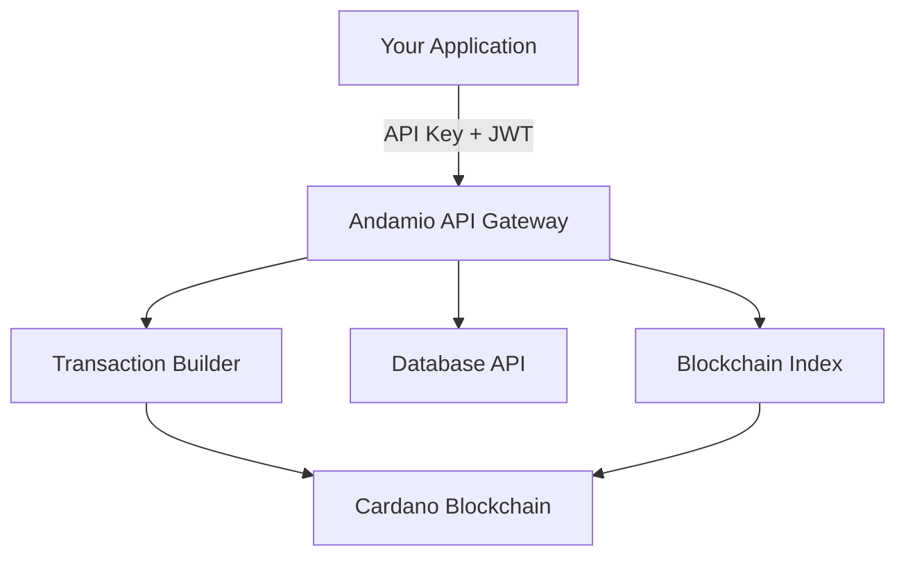
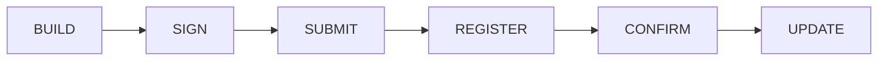

# Andamio API

The Andamio API is a single gateway for building Web3 education platforms on Cardano. It combines blockchain transactions, off-chain content, and contributor progress tracking behind a developer-friendly interface.

Use it to create courses, manage projects, track submissions, and issue credentials without wiring each Cardano subsystem yourself.

## What You Can Build

### Courses

Create structured learning experiences with on-chain enrollment and credential issuance.

- **Owners** create courses and manage teacher rosters
- **Teachers** design modules with Student Learning Targets (SLTs), review submissions, and assess assignments
- **Students** enroll, submit assignment evidence, and claim credential NFTs after completion

### Projects

Coordinate real-world contributions with task bounties and on-chain accountability.

- **Owners** create projects and define who can assess work
- **Managers** publish tasks with deadlines and bounty amounts, then review submissions
- **Contributors** commit to tasks, submit evidence, and claim rewards after approval

### Credentials

Completed courses and assessed project tasks can mint on-chain credentials directly to a participant's wallet. Those credentials are non-fungible tokens that can be verified on Cardano.

## How It Works

The API sits in front of specialized Andamio subsystems and exposes one consistent interface:



| Subsystem | What It Does | You See It As |
|-----------|--------------|---------------|
| **Transaction Builder** | Constructs unsigned Cardano transactions for users to sign | `POST /api/v2/tx/...` endpoints that return CBOR |
| **Database API** | Stores off-chain content such as titles, descriptions, evidence, and drafts | Content merged into response objects |
| **Blockchain Index** | Reads on-chain state such as enrollment, ownership, role membership, and publication status | Chain state merged into response objects |

You do not call these subsystems directly. The gateway merges their data so a single request can return on-chain state alongside off-chain content.

## API Structure

V2 endpoints follow a consistent pattern:

```txt
/api/v2/{domain}/{role}/{resource}/{action}
```

Examples:

- `/api/v2/course/student/assignments/list` — list assignments for a student
- `/api/v2/project/manager/tasks/manage` — create or remove project tasks on-chain
- `/api/v2/tx/register` — register a submitted transaction for tracking

| Group | Purpose |
|-------|---------|
| **Authentication** | Wallet-based login with CIP-30 and developer accounts |
| **API Keys** | Key generation, rotation, and usage stats |
| **Courses** | Course creation, enrollment, teaching, assessment, and credentialing |
| **Projects** | Project creation, task commitment, submission, assessment, and rewards |
| **Transaction Builder** | Unsigned transactions for on-chain operations |
| **Transaction Tracking** | Register, poll, and stream transaction state |

Explore the full interactive reference: [mainnet API reference](https://mainnet.api.andamio.io/reference) or [preprod API reference](https://preprod.api.andamio.io/reference).

## Authentication

The API uses two authentication layers.

### 1. Your application authenticates with an API key

```bash
curl -H "X-API-Key: YOUR_KEY" \
  https://preprod.api.andamio.io/api/v2/course/user/courses/list
```

API keys identify your application, enforce rate limits, and track usage. Generate one from the Andamio app's API setup flow.

### 2. Your users authenticate with a Cardano wallet

```txt
1. GET  /api/v2/auth/login/session    -> nonce
2. User signs nonce with a CIP-30 wallet
3. POST /api/v2/auth/login/validate   -> JWT
4. Include the JWT as Authorization: Bearer <token>
```

Public endpoints, such as listing published courses, need only an API key. User-scoped operations, such as submitting an assignment or assessing a task, need both an API key and the user's JWT.

## Transaction Lifecycle

On-chain actions follow the same lifecycle:



| Step | Who Does It | What Happens |
|------|-------------|--------------|
| **BUILD** | Your app calls the API | Gateway returns an unsigned transaction as CBOR |
| **SIGN** | User's browser wallet | User reviews and signs the transaction |
| **SUBMIT** | User's browser wallet | Signed transaction is submitted to Cardano |
| **REGISTER** | Your app calls the API | Transaction hash is registered for tracking |
| **CONFIRM** | Gateway | Gateway watches the chain until confirmation |
| **UPDATE** | Gateway | Confirmed on-chain data is synced to the database |

After registering a transaction, track it with Server-Sent Events or polling:

```javascript
// Server-Sent Events
const source = new EventSource(`/api/v2/tx/stream/${txHash}`);
source.addEventListener('state_change', (event) => {
  const { old_state, new_state } = JSON.parse(event.data);
  console.log(`${old_state} -> ${new_state}`);
});

// Polling
const response = await fetch(`/api/v2/tx/status/${txHash}`);
const { state } = await response.json();
```

The gateway handles confirmation polling, retries, database synchronization, and recovery. For the full state machine, see [Transaction State Machine](/docs/protocol/v2/state-machine).

## Draft-First Workflow

Courses and projects can use a draft-first pattern:

```txt
1. Create content in the database as a draft  -> instant, no blockchain cost
2. Edit and preview until ready               -> iterate freely
3. Publish on-chain via transaction           -> permanent Cardano record
4. Gateway links draft to on-chain record     -> seamless transition
```

This lets users prepare courses, modules, tasks, and assignment instructions before committing them to the blockchain.

## Merged Data

Many endpoints return merged responses that combine chain state with off-chain content:

```json
{
  "course_id": "abc123def456...",
  "owner": "james",
  "teachers": ["james", "alice"],
  "content": {
    "title": "Introduction to Cardano Development",
    "description": "Learn to build on Cardano...",
    "image_url": "https://..."
  },
  "source": "merged"
}
```

- Top-level fields usually come from the blockchain
- `content` comes from the database
- `source` explains whether data is `merged`, `chain_only`, or `db_only`

If one backend is temporarily unavailable, the API can return partial data with `source` indicating what is missing instead of failing the whole request.

## Quick Start

```bash
# 1. List published courses with an API key
curl -H "X-API-Key: YOUR_KEY" \
  https://preprod.api.andamio.io/api/v2/course/user/courses/list

# 2. Get details for one course
curl -H "X-API-Key: YOUR_KEY" \
  https://preprod.api.andamio.io/api/v2/course/user/course/get/COURSE_ID

# 3. Build an authenticated transaction
curl -X POST \
  -H "X-API-Key: YOUR_KEY" \
  -H "Authorization: Bearer YOUR_JWT" \
  -H "Content-Type: application/json" \
  -d '{"alias":"james","course_id":"COURSE_ID","slt_hash":"abc123..."}' \
  https://preprod.api.andamio.io/api/v2/tx/course/student/assignment/commit

# 4. Register the transaction after wallet signing and submission
curl -X POST \
  -H "X-API-Key: YOUR_KEY" \
  -H "Authorization: Bearer YOUR_JWT" \
  -H "Content-Type: application/json" \
  -d '{"tx_hash":"HASH_FROM_WALLET","tx_type":"assignment_submit"}' \
  https://preprod.api.andamio.io/api/v2/tx/register
```

<Callout title="Use preprod first">
Start with `preprod.api.andamio.io` while building and testing. Move to mainnet only after your app flow is verified.
</Callout>

## What's Next

<Cards>
  <Card title="Getting Started" href="/docs/getting-started">
    Set up your wallet, API key, and local development environment.
  </Card>
  <Card title="Developer Guides" href="/docs/guides/developers">
    Build your first app flow with Andamio.
  </Card>
  <Card title="Protocol V2" href="/docs/protocol/v2">
    Understand the smart contracts and on-chain data model.
  </Card>
  <Card title="API Reference" href="https://preprod.api.andamio.io/reference">
    Explore endpoints interactively on preprod.
  </Card>
</Cards>
