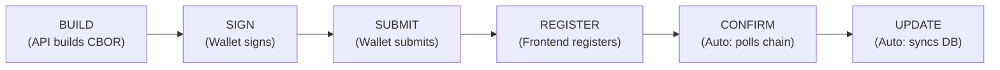
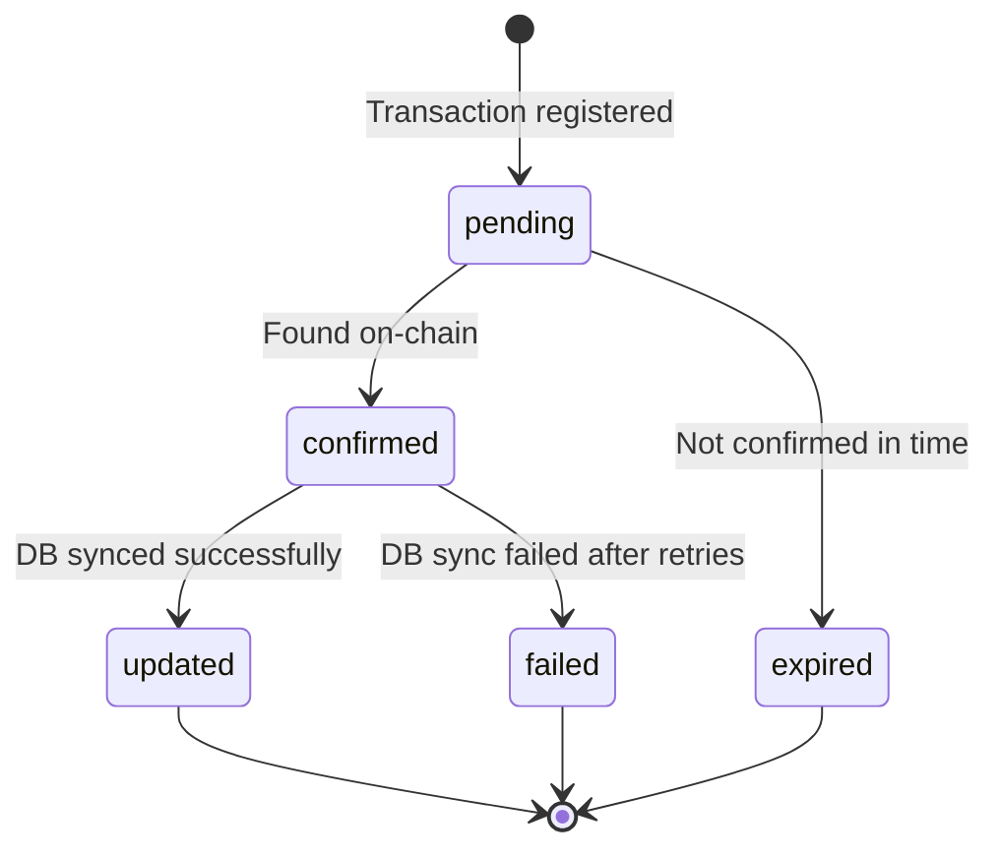
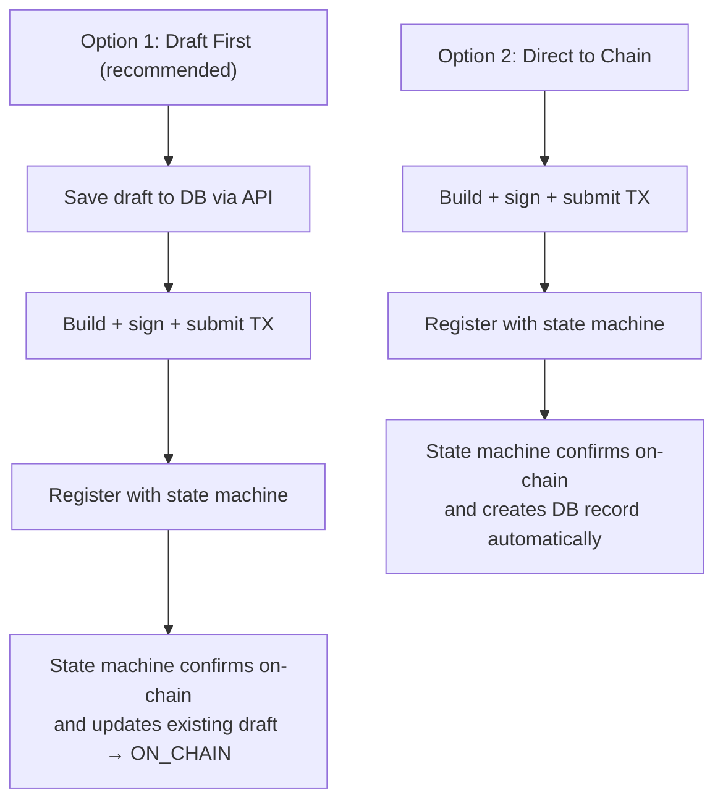

# Transaction State Machine

Every Andamio blockchain transaction follows a consistent 6-step lifecycle, managed automatically by the API Gateway.

## Lifecycle



| Step | Who | What Happens |
|------|-----|--------------|
| **BUILD** | API Gateway | Builds an unsigned transaction (CBOR) |
| **SIGN** | User's wallet | User signs the transaction in their browser wallet |
| **SUBMIT** | User's wallet | Signed transaction is submitted to the Cardano network |
| **REGISTER** | Frontend | Calls the registration endpoint with the transaction hash and type |
| **CONFIRM** | Gateway (automatic) | Polls the blockchain until the transaction appears on-chain |
| **UPDATE** | Gateway (automatic) | Syncs the confirmed on-chain data to the Andamio database |

## State Transitions

Once a transaction is registered, it enters the state machine and transitions automatically:



| State | Meaning |
|-------|---------|
| `pending` | Submitted to Cardano, awaiting on-chain confirmation |
| `confirmed` | Found on-chain, database update in progress (or not needed) |
| `updated` | Database synchronized — terminal success |
| `failed` | Database sync retries exhausted — terminal failure |
| `expired` | Not confirmed on-chain within the timeout window — terminal |

All database updates are **idempotent** — if a sync is interrupted and retried, it produces the same result.

## Transaction Types

Andamio supports 17 transaction types across three categories:

### Global

| Transaction | Type Key | Role | DB Sync |
|-------------|----------|------|---------|
| Mint Access Token | `access_token_mint` | User | No |

### Course

| Transaction | Type Key | Role | DB Sync |
|-------------|----------|------|---------|
| Create Course | `course_create` | Owner | Yes |
| Enroll in Course | `course_enroll` | Student | No |
| Manage Teachers | `teachers_update` | Owner | Yes |
| Manage Modules | `modules_manage` | Teacher | Yes |
| Submit Assignment | `assignment_submit` | Student | Yes |
| Assess Assignments | `assessment_assess` | Teacher | Yes |
| Claim Course Credential | `credential_claim` | Student | No |

### Project

| Transaction | Type Key | Role | DB Sync |
|-------------|----------|------|---------|
| Create Project | `project_create` | Owner | Yes |
| Manage Managers | `managers_manage` | Owner | Yes |
| Manage Blacklist | `blacklist_update` | Owner | No |
| Manage Tasks | `tasks_manage` | Manager | Yes |
| Commit to Task | `project_join` | Contributor | Yes |
| Submit Task Work | `task_submit` | Contributor | Yes |
| Assess Tasks | `task_assess` | Manager | Yes |
| Claim Project Credential | `project_credential_claim` | Contributor | Yes |
| Fund Treasury | `treasury_fund` | User | No |

**"No" DB Sync** means the blockchain is the sole source of truth for that data.
**"Yes" DB Sync** means the Gateway automatically synchronizes on-chain state to the database after confirmation.

## Integration Flow

The full flow for building, signing, and tracking a transaction:

```
1. POST /api/v2/tx/{build-endpoint}         → unsigned_tx (+ course_id/project_id for creates)
2. wallet.signTx(unsigned_tx)                → signed_tx
3. wallet.submitTx(signed_tx)                → tx_hash
4. POST /api/v2/tx/register                  → { state: "pending" }
5. GET  /api/v2/tx/stream/{tx_hash}   (SSE)  → real-time state change events
   OR
   GET  /api/v2/tx/status/{tx_hash}  (poll)  → check state periodically
```

All build endpoints require authentication via `Authorization: Bearer <jwt>` or `X-API-Key: <key>`.

## Registration

After submitting a transaction to the Cardano network, register it with the state machine:

**`POST /api/v2/tx/register`**

```json
{
  "tx_hash": "64-char hex hash from wallet.submitTx()",
  "tx_type": "course_create",
  "instance_id": "optional course_id or project_id",
  "metadata": {}
}
```

Most transaction types require **no metadata**. Only three types need it:

| Type | Required Metadata |
|------|-------------------|
| `course_create` | `owner_alias` (auto-captured, no action needed) |
| `project_join` | `task_hash` (required — 64 hex chars) |
| `project_credential_claim` | `task_hash` (required — 64 hex chars) |

Registering the same `tx_hash` twice returns `409 Conflict`.

## Commitment Lifecycle

Several transaction types involve **commitments** — records that link a participant to a piece of work (an assignment or a task). These commitments follow a draft-to-chain lifecycle that gives developers two integration paths.

### Two Paths to On-Chain



**Draft-first** is recommended because it gives users immediate feedback — they can see their pending commitment in the UI before the blockchain transaction confirms. But if a client goes straight to chain (skipping the draft step), the state machine handles it automatically by creating the DB record on confirmation.

### Assignment Commitments (Courses)

When a student submits an assignment (`assignment_submit`):

1. **Optional**: Create a draft commitment via the API — the student's intent is saved immediately
2. **Required**: Build and submit the on-chain transaction, then register it
3. **Automatic**: On confirmation, the state machine either updates the existing draft or creates a new record, setting the status to `ON_CHAIN`

Status progression: `DRAFT` → `ON_CHAIN` → `ACCEPTED` or `REFUSED` (after teacher assessment)

### Task Commitments (Projects)

When a contributor commits to a task (`project_join`):

1. **Optional**: Create a draft commitment via the API
2. **Required**: Build and submit the on-chain transaction, then register with `task_hash` in metadata
3. **Automatic**: On confirmation, the state machine confirms the commitment and links the contributor to the task

Status progression: `DRAFT` → `COMMITTED` → `SUBMITTED` → `ACCEPTED` or `REFUSED` → `REWARDED`

> **Note**: A contributor's first commit to a project also "joins" the project by minting a contributor token. Subsequent commits by the same contributor do not mint again. The state machine handles both cases transparently.

### Task Drafts

Managers can also create tasks as drafts in the database before publishing them on-chain via `tasks_manage`. When the on-chain transaction confirms, the state machine automatically matches new on-chain tasks to existing drafts by content hash and updates their status to `ON_CHAIN`.

## Monitoring

| Endpoint | Purpose |
|----------|---------|
| `GET /api/v2/tx/status/:tx_hash` | Current state of a single transaction |
| `GET /api/v2/tx/pending` | All tracked transactions for the authenticated user |
| `GET /api/v2/tx/types` | List all valid transaction types |
| `GET /api/v2/tx/stream/:tx_hash` | SSE stream — real-time state change events |

### SSE Stream Events

| Event | When | Payload |
|-------|------|---------|
| `state` | Immediately on connect | Current state |
| `state_change` | Each transition | `{ tx_hash, old_state, new_state, timestamp }` |
| `complete` | Terminal state reached | `{ tx_hash, final_state }` — stream auto-closes |

## Self-Healing

If a transaction is confirmed on-chain but the database update was missed (for example, due to a service restart), the Gateway automatically detects and repairs the inconsistency when related data is next accessed. This is transparent to API consumers — no manual intervention is needed.

<Callout type="info">
**Important Notes**

- **Course and project creation return IDs**: The build response includes a `course_id` or `project_id`. Save these — they're the on-chain policy IDs used for all subsequent operations.
- **Single teacher/manager at creation**: Courses start with one teacher and projects start with one manager (the creator). Use the manage endpoints to add more after creation.
- **Not yet implemented**: Task Leave and Task Update sub-actions have build endpoints but are not yet tracked by the state machine. The on-chain effects still work.
</Callout>
