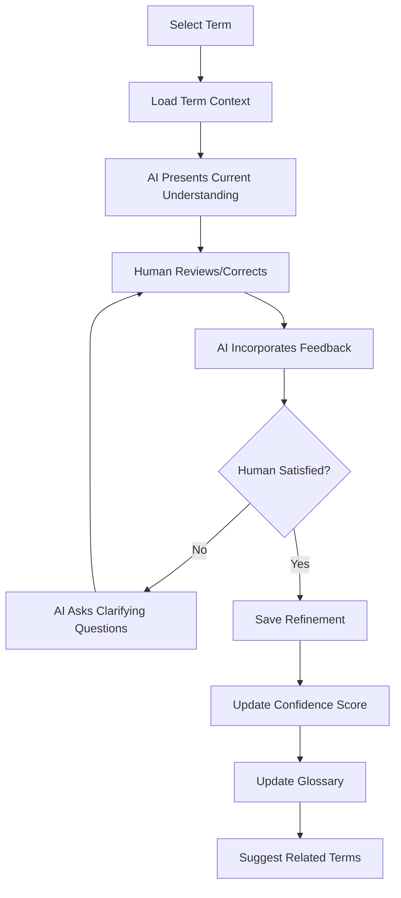

# Glossary Game Web Application Plan

## Overview
A Next.js 14+ web application using AI SDK for Claude integration, enabling collaborative terminology refinement through structured dialogue between AI and human experts. This transforms the current CLI-based Concept Validation Game into a scalable web platform.

## Architecture Overview

### Tech Stack
- **Framework**: Next.js 14+ with App Router
- **AI Integration**: AI SDK with Anthropic Claude
- **Database**: PostgreSQL/Supabase for persistence
- **UI**: Tailwind CSS + shadcn/ui components
- **Language**: TypeScript throughout
- **Authentication**: Supabase Auth (or NextAuth.js)

## Data Models

```typescript
interface Term {
  id: string
  name: string
  category: 'core' | 'technical' | 'business' | 'tokenomics' | 'partnerships'
  currentDefinition: string
  refinementHistory: Refinement[]
  confidence: 'low' | 'medium' | 'high'
  isPublic: boolean
  relatedTerms?: string[]
  createdAt: Date
  updatedAt: Date
}

interface Refinement {
  id: string
  termId: string
  timestamp: Date
  agentProposal: string
  humanFeedback: string
  finalDefinition: string
  userId: string
  sessionId: string
  changeType: 'major' | 'minor' | 'clarification'
}

interface User {
  id: string
  email: string
  role: 'admin' | 'editor' | 'viewer'
  contributions: number
}
```

## Application Structure

```
app/
├── api/
│   ├── chat/route.ts          # AI conversation endpoint
│   ├── terms/
│   │   ├── route.ts           # List/create terms
│   │   └── [id]/route.ts      # Get/update/delete term
│   ├── refinements/route.ts   # Refinement history
│   └── export/route.ts        # Export to MDX/Markdown
├── game/
│   ├── page.tsx               # Term selection/overview
│   ├── [termId]/
│   │   └── page.tsx           # Individual term refinement session
│   └── layout.tsx             # Game layout with context
├── glossary/
│   ├── page.tsx               # Browse refined glossary
│   └── [category]/page.tsx   # Category-filtered view
├── admin/
│   └── page.tsx               # Admin dashboard
├── layout.tsx                 # Root layout with navigation
└── page.tsx                   # Landing page
```

## Game Flow



## Key Features

### Core Functionality
1. **Real-time Collaboration**: Multiple users can refine different terms simultaneously
2. **Version Tracking**: Complete history of each term's evolution with diffs
3. **Confidence Scoring**: AI indicates certainty level for each definition
4. **Export Capability**: Generate MDX files for docs integration
5. **Role-based Access**: Public vs team-internal terms

### Advanced Features
1. **Relationship Mapping**: Visual graph of term relationships
2. **Batch Refinement**: Work through related terms as a set
3. **AI Suggestions**: Proactive identification of terms needing refinement
4. **Quality Metrics**: Track definition quality and completeness
5. **Review Workflow**: Approval process for public glossary updates

## API Implementation

### Chat Endpoint
```typescript
// app/api/chat/route.ts
import { streamText } from 'ai';
import { anthropic } from '@ai-sdk/anthropic';
import { z } from 'zod';

export async function POST(req: Request) {
  const { termId, message, history } = await req.json();

  // Load term context from database
  const term = await getTerm(termId);

  const result = streamText({
    model: anthropic('claude-3-5-sonnet'),
    system: `You are refining Andamio terminology. Current term: ${term.name}
             Current definition: ${term.currentDefinition}
             Confidence: ${term.confidence}
             Help refine this definition through collaborative dialogue.`,
    messages: [...history, { role: 'user', content: message }],
    tools: {
      updateDefinition: tool({
        description: 'Propose updated term definition',
        parameters: z.object({
          definition: z.string(),
          confidence: z.enum(['low', 'medium', 'high']),
          keyChanges: z.array(z.string()),
        })
      }),
      askClarification: tool({
        description: 'Ask clarifying questions',
        parameters: z.object({
          questions: z.array(z.string()),
        })
      }),
      suggestRelated: tool({
        description: 'Suggest related terms to refine',
        parameters: z.object({
          terms: z.array(z.string()),
        })
      })
    }
  });

  return result.toUIMessageStreamResponse();
}
```

### Export Endpoint
```typescript
// app/api/export/route.ts
export async function GET(req: Request) {
  const { searchParams } = new URL(req.url);
  const format = searchParams.get('format') || 'mdx';
  const visibility = searchParams.get('visibility') || 'public';

  const terms = await getTerms({ isPublic: visibility === 'public' });

  if (format === 'mdx') {
    const mdx = generateMDX(terms);
    return new Response(mdx, {
      headers: {
        'Content-Type': 'text/mdx',
        'Content-Disposition': `attachment; filename="glossary-${visibility}.mdx"`
      }
    });
  }

  // Handle other formats...
}
```

## UI Components

### Key Components
1. **TermSelector**: Search/filter interface with categories and confidence indicators
2. **RefinementEditor**: Split-pane view (AI proposal | Human feedback)
3. **DiffViewer**: Visual comparison of definition changes
4. **ConfidenceIndicator**: Visual representation of AI's confidence
5. **HistoryTimeline**: Browse refinement history
6. **ExportButton**: Generate MDX/Markdown with options

### Component Example
```tsx
// components/RefinementEditor.tsx
export function RefinementEditor({ term, onUpdate }: Props) {
  const { messages, sendMessage, isLoading } = useChat({
    api: '/api/chat',
    body: { termId: term.id }
  });

  return (
    <div className="grid grid-cols-2 gap-4">
      <div className="space-y-4">
        <h3>AI Understanding</h3>
        <div className="prose">
          {messages.filter(m => m.role === 'assistant').map(m => (
            <div key={m.id}>{m.content}</div>
          ))}
        </div>
      </div>

      <div className="space-y-4">
        <h3>Your Feedback</h3>
        <textarea
          onKeyDown={(e) => {
            if (e.key === 'Enter' && e.metaKey) {
              sendMessage(e.currentTarget.value);
            }
          }}
          placeholder="Provide corrections or additional context..."
        />
      </div>
    </div>
  );
}
```

## Deployment Strategy

### Infrastructure
- **Hosting**: Vercel (optimal for Next.js, automatic preview deployments)
- **Database**: Supabase (PostgreSQL + auth + real-time subscriptions)
- **CDN**: Vercel Edge Network for static assets
- **Monitoring**: Vercel Analytics + Sentry for error tracking

### Environment Configuration
```env
# .env.local
ANTHROPIC_API_KEY=sk-ant-...
SUPABASE_URL=https://...supabase.co
SUPABASE_ANON_KEY=...
SUPABASE_SERVICE_KEY=...
NEXT_PUBLIC_APP_URL=https://glossary.andamio.io
```

### CI/CD Pipeline
```yaml
# .github/workflows/deploy.yml
name: Deploy
on:
  push:
    branches: [main]
  pull_request:

jobs:
  test:
    runs-on: ubuntu-latest
    steps:
      - uses: actions/checkout@v3
      - run: npm ci
      - run: npm test
      - run: npm run type-check

  deploy:
    needs: test
    if: github.ref == 'refs/heads/main'
    runs-on: ubuntu-latest
    steps:
      - uses: actions/checkout@v3
      - run: vercel deploy --prod
```

## Progressive Enhancement Roadmap

### Phase 1: MVP (Week 1-2)
- Single-player refinement sessions
- Basic term CRUD operations
- Export to MDX functionality
- Simple confidence scoring

### Phase 2: Collaboration (Week 3-4)
- User authentication
- Multi-user support
- Role-based permissions
- Refinement history

### Phase 3: Advanced Features (Week 5-6)
- Real-time collaboration on same term
- Related terms suggestions
- Batch refinement workflows
- Quality metrics dashboard

### Phase 4: Integration (Week 7-8)
- Auto-sync with documentation repo
- GitHub PR automation for glossary updates
- Webhook notifications for major updates
- API for external consumption

## Integration with Existing Documentation

### Automated Sync
1. **Export Trigger**: On approval of term refinements
2. **Format Generation**: Create MDX files matching current structure
3. **Git Integration**: Auto-commit to documentation repo
4. **PR Creation**: Open PR with glossary updates
5. **Review Process**: Team review before merge

### File Generation
```typescript
// lib/generateMDX.ts
export function generateMDX(terms: Term[]) {
  const publicTerms = terms.filter(t => t.isPublic);
  const categories = groupBy(publicTerms, 'category');

  return `---
title: Glossary
description: A reference guide for key terms used throughout Andamio documentation.
---

# Andamio Glossary

${Object.entries(categories).map(([cat, terms]) => `
## ${capitalize(cat)}

${terms.map(term => `
### ${term.name}
${term.currentDefinition}
`).join('\n')}
`).join('\n')}

---
*Last updated: ${new Date().toISOString()}*
`;
}
```

## Security Considerations

1. **API Rate Limiting**: Prevent abuse of AI endpoints
2. **Input Validation**: Sanitize all user inputs
3. **Authentication**: Require auth for editing capabilities
4. **Audit Logging**: Track all definition changes
5. **Backup Strategy**: Regular database backups
6. **Content Moderation**: Review queue for public terms

## Success Metrics

1. **Terms Refined**: Number of terms with high confidence
2. **User Engagement**: Active refinement sessions per week
3. **Quality Score**: Average confidence across glossary
4. **Export Frequency**: How often glossary is exported/updated
5. **Collaboration Rate**: Multiple users refining related terms

## Technical Requirements

### Performance Targets
- Page load: < 1s
- AI response: < 3s
- Export generation: < 5s
- Search results: < 200ms

### Browser Support
- Chrome 90+
- Firefox 88+
- Safari 14+
- Edge 90+

### Accessibility
- WCAG 2.1 AA compliance
- Keyboard navigation
- Screen reader support
- High contrast mode

## Estimated Timeline

- **Week 1-2**: MVP development
- **Week 3-4**: Testing and refinement
- **Week 5-6**: Advanced features
- **Week 7-8**: Integration and deployment
- **Total**: 8 weeks to production-ready application

## Budget Considerations

### Monthly Costs (Estimated)
- Vercel Pro: $20/month
- Supabase Pro: $25/month
- Anthropic API: ~$50/month (based on usage)
- Domain: $15/year
- **Total**: ~$100/month

## Conclusion

This web-based Glossary Game application will transform the current CLI-based concept validation into a collaborative, scalable platform. It enables the entire Andamio team to refine terminology together while maintaining full history, providing confidence metrics, and seamlessly integrating with existing documentation systems.

The phased approach ensures quick delivery of core functionality while building toward a comprehensive terminology management system that can grow with Andamio's needs.