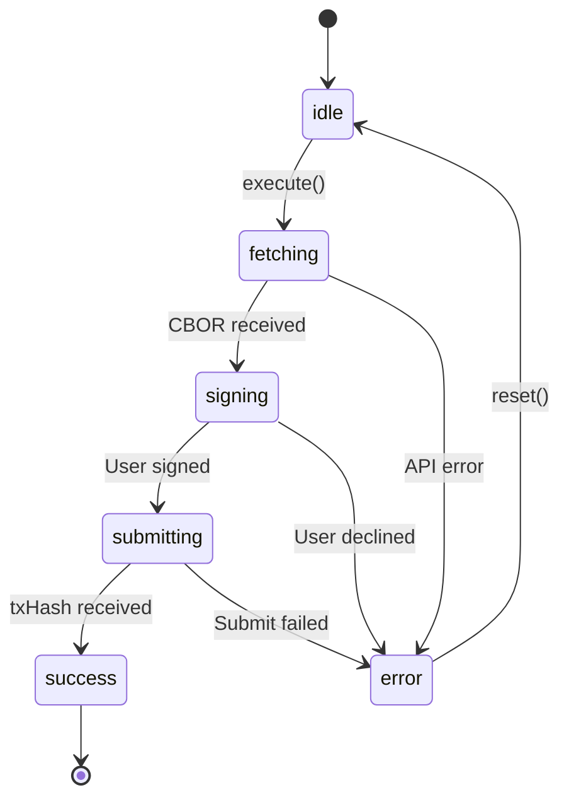

# Add TxSM Architecture Patterns Documentation

This plan addresses two related GitHub issues that add architectural pattern documentation to the Transaction State Machine (TxSM) docs.

## Overview

**Issue #6**: Add visual state diagrams and CEI pattern documentation to `state-machine/index.mdx`
**Issue #7**: Add a happy path example for `COURSE_STUDENT_CREDENTIAL_CLAIM` flow

Both issues emerged from TxSM research and aim to make the docs more actionable for developers by showing explicit architectural patterns and concrete examples.

## Problem Statement

The current TxSM documentation explains WHAT happens but lacks:
1. **Client-side state visualization** — developers don't see the full picture of client states (idle → fetching → signing → submitting → success/error)
2. **Explicit architectural patterns** — CEI pattern and "hash on-chain, data off-chain" are implicit
3. **Concrete happy path examples** — developers need to trace one complete flow end-to-end

## Proposed Solution

### Phase 1: Enhance state-machine/index.mdx (Issue #6)

Add three new sections to the existing TxSM index page:

1. **Client Transaction States diagram** — Mermaid `stateDiagram-v2` showing the client-side state machine
2. **Architecture Pattern: CEI** — Table explaining Check-Effect-Interact across client/gateway
3. **Data Model: Hash On-Chain, Data Off-Chain** — Explanation of the commitment hash pattern

### Phase 2: Add Happy Path Example (Issue #7)

Create a new guide or section showing the complete `COURSE_STUDENT_CREDENTIAL_CLAIM` flow:
- Prerequisites
- Step-by-step table with layer/action columns
- User-facing timeline ("What the User Sees")
- CEI pattern applied to this specific transaction

## Acceptance Criteria

### Issue #6 Deliverables

- [x] Add "Client Transaction States" Mermaid diagram to `state-machine/index.mdx`
  - States: idle → fetching → signing → submitting → success/error
  - Transitions: execute(), CBOR received, User signed, txHash received, reset()

- [x] Add "Gateway Confirmation States" Mermaid diagram (already exists at line 32, verify completeness)
  - States: pending → confirmed → updated/failed/expired

- [x] Add "Architecture Pattern: Check-Effect-Interact (CEI)" section
  - Table with Client vs Gateway columns
  - Rows: Check, Effect, Interact phases
  - Note: "client never writes to DB directly"

- [x] Add "Data Model: Hash On-Chain, Data Off-Chain" section
  - Example: `assignment_info: "sha256:abc123..."` vs `evidence: { url, text }`
  - Why: blockchain space, privacy, verifiability

### Issue #7 Deliverables

- [x] Create credential claim happy path example
  - Location: New section in `state-machine/index.mdx` OR new guide file
  - Prerequisites table
  - 8-step flow table (Click → Build → Sign → Submit → Register → Monitor → Confirm → Complete)
  - "What the User Sees" timeline with spinner states
  - CEI pattern applied table

## Technical Approach

### File Changes

| File | Change |
|------|--------|
| `content/docs/protocol/v2/state-machine/index.mdx` | Add 3 new sections (Issue #6) + example section (Issue #7) |

### Mermaid Syntax Pattern

Based on existing usage at line 32:

```mdx
<Mermaid chart='stateDiagram-v2\n    [*] --> idle\n    idle --> fetching: execute()\n    fetching --> signing: CBOR received\n    ...' />
```

Key conventions:
- Use escaped `\n` for newlines
- Chart content as single-quoted string
- Component is globally registered (no import needed)

### Section Placement

Recommended order in `state-machine/index.mdx`:

1. Existing: Lifecycle (line 15)
2. **NEW: Client Transaction States** (after existing lifecycle diagram)
3. Existing: State Transitions (line 28)
4. **NEW: CEI Pattern section** (after State Transitions)
5. **NEW: Hash On-Chain, Data Off-Chain** (after CEI)
6. Existing: Transaction Types (line 44)
7. ...
8. **NEW: Example Flow: Claiming a Course Credential** (before or after Monitoring section)

### Content from Issues

**Client State Diagram (Issue #6):**


**CEI Table (Issue #6):**
| Phase | Client | Gateway |
|-------|--------|---------|
| **Check** | Validate params (Zod) | Validate eligibility, balances |
| **Effect** | Sign transaction | Confirm on-chain |
| **Interact** | Submit to blockchain | Sync to database |

**Happy Path Table (Issue #7):**
| Step | Layer | What Happens |
|------|-------|--------------|
| 1. Click "Claim Credential" | UI | `useTransaction().execute({ txType: "COURSE_STUDENT_CREDENTIAL_CLAIM", ... })` |
| 2. Build | Client → Gateway | POST `/api/v2/tx/course/student/credential/claim` → unsigned CBOR |
| 3. Sign | Client → Wallet | `wallet.signTxReturnFullTx(cbor, true)` — user approves |
| 4. Submit | Client → Blockchain | `wallet.submitTx(signed)` → txHash |
| 5. Register | Client → Gateway | POST `/api/v2/tx/register` with `{ tx_hash, tx_type: "credential_claim" }` |
| 6. Monitor | Client ← Gateway | SSE stream at `/api/v2/tx/stream/{txHash}` |
| 7. Confirm | Gateway | ~30s later: `pending → confirmed → updated` |
| 8. Complete | UI | Toast: "Credential claimed!" — credential NFT now in wallet |

## Dependencies & Prerequisites

- None — this is additive documentation work
- Existing Mermaid component is functional

## Success Metrics

- Developers can visualize client-side transaction states
- CEI pattern is explicitly documented and findable
- "Hash on-chain, data off-chain" pattern is explained
- One complete happy path example exists as a reference

## Risks

| Risk | Mitigation |
|------|------------|
| index.mdx becomes too long | Consider extracting to separate pages if > 400 lines |
| Mermaid diagrams don't render | Test locally with `npm run dev` before committing |

## Implementation Notes

1. Keep the Gateway Confirmation States diagram that already exists (line 32)
2. The new Client Transaction States diagram shows a different perspective (client-side vs gateway-side)
3. The happy path example should reference the existing `student-credential-claim.mdx` for full API details

## Sources & References

### Internal References
- Existing state diagram: `content/docs/protocol/v2/state-machine/index.mdx:32`
- Credential claim API: `content/docs/protocol/v2/state-machine/course/student-credential-claim.mdx`
- Transaction handling guide: `content/docs/guides/developers/transactions.mdx`
- Mermaid component: `components/mdx/mermaid.tsx`

### Related Issues
- GitHub Issue #6: Add TxSM visual state diagrams and CEI pattern documentation
- GitHub Issue #7: Add happy path example: COURSE_STUDENT_CREDENTIAL_CLAIM flow
