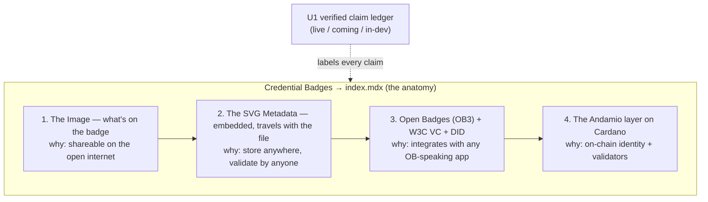

# feat: Credential Badge Anatomy Explainer page

## Summary

Add one new MDX page to `andamio-docs` that walks a technical integrator through the
full anatomy of an Andamio Credential Badge — four layers, each saying *what it is* and
*why it matters* — with **every technical claim carrying a verified `[live]` / `[coming]`
/ `[in-dev]` label**. The page is an orientation / credibility document ("understand what
a credential actually is before you build on it"), so it lives **top-level** as a new
`Credential Badges` section surfaced early in the "Understand / before you build" zone of
the nav — deliberately *not* buried under Protocol internals. Its one hard dependency is
accuracy: every claim is verified against the local `credential-badges` repo + live
endpoints, never written from memory.

**Plan depth:** Standard (single page, but with a load-bearing cross-repo fact-check, new
nav placement, and known brief-vs-source discrepancies to reconcile).

---

## Problem Frame

Andamio has been building a product customers can't see. The credential badge is the
first *visible* piece — a real image with genuinely novel tech baked in. The story needs
grounding in documentation before it can be sold or pointed at. There is no root doc that
explains, end to end, what an Andamio credential *is* at a technical level.

The page serves the **technical integrator, not the buyer**. It is a credibility document:
enough real mechanics that an integrator trusts the badge is what we claim. The landing
page may later point a buyer-facing subset *at* this page; this page itself is honest
technical reporting, not marketing.

**The hard rule (carried verbatim from origin):** some of what's in scope is promised but
not 100% delivered, and that's fine — *if and only if* it's labeled truthfully. An
unlabeled or wrong claim makes the page **actively harmful — worse than no page**.

---

## Origin & Scope

The origin handoff brief is the source of truth for *what* to build. It defines the four
anatomy features, the honest-labeling rule, and a "Verified facts" ledger to check against
source. This plan carries all of it forward and resolves the brief's two open questions
(page organization, fumadocs constraints) below.

### In scope

- One new MDX page: the four-layer anatomy (Image → SVG metadata → OB3/DID → Cardano),
  each with *what it is* + *why it matters*.
- Honest `[live] / [coming] / [in-dev]` labels on every technical claim, sourced from a
  verification pass, not memory.
- A new top-level `Credential Badges` nav section, page as its index, placed early in the
  learning journey.
- A vendored, real badge image embedded in the page (static-but-live).

### Out of scope (non-goals — origin)

- **No changes to the credential badge itself** — it's in active development. This page
  documents; it does not build.
- **No overclaiming** — nothing undelivered is implied as live.

### Deferred to Follow-Up Work

- **Interactive anatomy component** — a custom React component (à la `TreasuryVerifier`)
  with clickable/hover callouts mapping the four layers onto a rendered badge. Confirmed
  deferred; static-but-live ships first.
- **Phase-2 IA reconciliation** — this page is deliberately placed top-level now. The
  proposed Phase-2 IA restructure (product roots: api/issuer/app/protocol/ecosystem,
  `.claude/skills/docs-governance/phase-2-ia-restructure.md`) will need to re-home or keep
  `Credential Badges`. Not a blocker — intent is to be top-level and early.
- **Roadmap #28 linkage** — add this page as a child of the Credential Badges Umbrella via
  the `/roadmap` skill in `andamio-ai-context` once that Umbrella exists. Out of this repo.
- **Buyer-facing subset / landing-page pointer** — a later experiment, not this page.

---

## Key Technical Decisions

### KTD1 — Placement: top-level `Credential Badges` section, anatomy as its index

Create `content/docs/credential-badges/` and make the anatomy explainer its `index.mdx`,
so landing on **Credential Badges** in the nav *is* the walkthrough (one click, no
burying). Surface it **early, in the "Understand / before you build" zone** of the root
`content/docs/meta.json` (the cluster currently holding `building-on-andamio`,
`light-paper`, `glossary`).

*Rationale:* this is an orientation/credibility doc, a different job from
`contract-verification` / `security-audit` (deep reference for someone already
integrating). `protocol/v2/` is explicitly the "advanced reference / Protocol internals"
basement — wrong audience-altitude. Folder-with-index (over a bare top-level page) makes
"Credential Badges" a first-class section the future Umbrella can grow into. *User
decision, confirmed.*

### KTD2 — Visualization: static-but-live via a **vendored** real badge SVG

Embed a real served badge by **capturing the SVG into `public/`** (e.g.
`public/images/credential-badges/`) and referencing it locally — not hot-linking
`credentials.andamio.io`.

*Rationale:* `next.config.mjs` `images.remotePatterns` only allows
`colony-recorder.s3.amazonaws.com`, so a live `next/image` from `credentials.andamio.io`
would need a config change; badge art is **mutable** per the source repo; the bare badges
path returns 403. A served badge SVG is **self-contained (fonts embedded, renders
standalone)**, so a vendored copy is a faithful, version-pinned artifact. *Trade-off:* the
vendored copy can drift from live → mitigate by recording the source URL + capture date in
a comment / caption. Interactive component deferred (KTD / Deferred).

### KTD3 — Honest-labeling convention

Every technical claim carries an inline tag — `**[live]**`, `**[coming]**`, or
`**[in-dev]**` — and each major section opens with a fumadocs `<Callout>` summarizing its
status (`type="success"` ≈ live, `type="warn"` ≈ coming/in-dev, `type="info"` ≈ neutral
context). Labels are sourced **only** from the verified claim ledger (U1). No new
component needed — `Callout` is already registered in `mdx-components.tsx`.

### KTD4 — Verification source of truth

Verify against, in priority order: the local **`credential-badges`** repo (`README.md`,
`MOC.md`, `ROADMAP.md`, `context/v0.jsonld`, `issuer/profile.jsonld`, `generator/`,
`spike/`), the **live endpoints** (`credentials.andamio.io/badges/...`, `/context/v0.jsonld`,
`/issuer`), and **andamioscan / the authenticated CLI** for on-chain claims. Where the
brief and the source disagree (see Risks), **label conservatively** (`coming` / `in-dev`)
and flag for owner confirmation rather than asserting `live`.

---

## High-Level Technical Design

The page is one document, four stacked anatomy layers from "what you can see" to "what's
anchored on-chain." Each layer is a section with *what it is* / *why it matters* / a status
label.



Nav placement (root `content/docs/meta.json`), early in the journey:

```
... front-door / product paths ...
--- Understand ---          (before-you-build zone)
credential-badges           <- NEW, top of the Understand cluster
building-on-andamio
light-paper
glossary
...
```

---

## Output Structure

```
content/docs/credential-badges/
├── meta.json              # section title "Credential Badges"
└── index.mdx              # the anatomy explainer (4 sections + labels + embedded badge)
public/images/credential-badges/
└── <captured-badge>.svg   # vendored real badge asset (source URL + date in caption)
content/docs/meta.json     # MODIFIED: add credential-badges entry in the Understand zone
```

The per-unit **Files** sections remain authoritative; the implementer may adjust the asset
path if a better convention exists.

---

## Implementation Units

### U1. Verify the claim ledger against source of truth

**Goal:** Produce a verified ledger mapping every technical claim to a true
`live` / `coming` / `in-dev` label, with a source citation per claim. This is the page's
one hard dependency and gates the prose in U4.

**Requirements:** Origin "Verified facts" + "hard rule"; Done-when "every claim verified",
"no claim from memory".

**Dependencies:** none (do first).

**Files:** working notes only — capture the ledger in this plan's scratch or a temporary
`docs/plans/` note; it is *not* shipped. The shipped artifact is the labeled prose in U4.

**Approach:** For each claim below, read the cited source in the local `credential-badges`
repo and/or probe the live endpoint, then assign the label the source actually supports:

- **Image / Proof Rings** — `credentials.andamio.io/badges/<course_id>.<slt_hash>.svg`
  returns HTTP 200 `image/svg+xml`, fonts embedded (self-contained); outer ring encodes
  `course_id`, inner ring `slt_hash`, per-course palette; `(course_id, slt_hash)` decodable;
  mainnet round-trip proven. **⚠ Reconcile** with `README.md`, which states the image is
  "presentation-layer only, **never identity-bearing**" and "keys off `badge_id` (a subset
  of 1+ modules), not the course or the SLT." Resolve the framing (likely: rings *visually*
  encode the id pair, but the *identity authority* is the on-chain anchor) before asserting
  anything as `live`. Escalate to the badge owner if unresolved.
- **SVG metadata** — OB3 metadata baked into each SVG (verify in `generator/`).
- **OB3 / DID layer** — JSON-LD context at `/context/v0.jsonld` (extension terms
  `onChainAnchor`, `onChainAttestation`, `accessToken`, `requires`, `prereqAttestation`);
  hosted issuer `Profile` at `/issuer`. **⚠ Verify** whether the issuer anchor is a live
  `did:web:credentials.andamio.io` or currently an `https` Profile URL with did:web as the
  "chosen target" (label `coming` if not live).
- **Cardano layer** — `policy_id` + credential hash (format `policy_id.credential_hash`);
  `evidence_hash` confirmed on-chain, retrievable via the authenticated CLI; validator
  details. **⚠ Known gap:** public `andamioscan` does **not** yet expose `evidence_hash`
  (`in-dev` — API-surface gap, not a data gap).
- **Badge baking (COMING)** — embedding the signed VC inside the SVG/PNG (e.g.
  `<openbadges:credential verify="<JWS>">`) so the image self-verifies offline. Spec
  finalized, not implemented → `coming`. Cross-check against `ROADMAP.md`.

**Patterns to follow:** the origin "Verified facts" block is the checklist; the source
repo's `MOC.md` maps where each fact lives.

**Test scenarios:**
- For each of the ~6 claim groups above, the ledger records: claim text, label, and a
  source citation (file path or endpoint). No claim lacks a citation.
- Every brief-vs-source discrepancy (rings/identity, did:web status) is explicitly
  resolved or flagged-for-owner — none silently dropped.
- Test expectation: this is a research/verification unit; verification *is* the output.

**Verification:** A complete ledger exists where every label is backed by a named source,
and both ⚠ discrepancies have a recorded resolution or escalation.

---

### U2. Scaffold the Credential Badges section + nav placement

**Goal:** Create the top-level section and wire it into the nav early in the "Understand"
zone, with a minimal valid page so the route resolves.

**Requirements:** Done-when "placed in IA under a technical/integrator path (not the
landing page)"; KTD1.

**Dependencies:** none (can run parallel to U1).

**Files:**
- `content/docs/credential-badges/meta.json` (create) — `{ "title": "Credential Badges" }`.
- `content/docs/credential-badges/index.mdx` (create) — valid frontmatter + a stub heading
  (filled in U4).
- `content/docs/meta.json` (modify) — add `"credential-badges"` at the top of the
  "Understand" cluster (just after the `--- Understand ---` divider, before
  `building-on-andamio`).

**Approach:** Mirror the existing flat technical pages for frontmatter shape
(`content/docs/protocol/v2/contract-verification.mdx` head: `title` + `description`). Use a
folder-with-index so the section reads as first-class and can grow.

**Patterns to follow:** `content/docs/protocol/v2/meta.json` for section meta shape; the
root `content/docs/meta.json` divider/label convention (`"--- Understand ---"`).

**Test scenarios:**
- After `npm run build` (or `npm run dev`), `/docs/credential-badges` resolves and renders
  the stub (no 404).
- The page appears in `.content-collections/generated/allDocs.js` — guards the CLAUDE.md
  gotcha that content-collections silently drops files with invalid frontmatter.
- "Credential Badges" shows in the sidebar within the Understand zone, above
  `building-on-andamio`.
- Test expectation for `meta.json` edits: none beyond the nav-render check — pure config.

**Verification:** Route resolves, nav entry present in the right place, file present in
generated docs.

---

### U3. Capture & vendor the badge image asset

**Goal:** Place one real, representative badge SVG in `public/` for embedding, with its
provenance recorded.

**Requirements:** "The Image" feature; KTD2.

**Dependencies:** U1 (to pick a badge whose `(course_id, slt_hash)` claims are verified).

**Files:**
- `public/images/credential-badges/<captured-badge>.svg` (create) — a real served badge
  SVG, captured from `credentials.andamio.io/badges/...`.

**Approach:** Fetch a specific real badge SVG (a `<course_id>.<slt_hash>.svg` that returns
200), confirm it renders standalone (fonts embedded), and commit it. Record the source URL
+ capture date in the page caption (U4) so drift from the mutable live art is visible.

**Patterns to follow:** images render via the `img → ImageZoom` override in
`mdx-components.tsx`; markdown `` is enough (zoomable). `ThemedImage` exists if
a light/dark variant is later wanted — not required now.

**Test scenarios:**
- The vendored SVG opens and renders standalone in a browser (fonts visible, no broken
  glyphs).
- Referenced from the page, it displays and is zoomable via ImageZoom.
- Test expectation: none beyond render check — static asset.

**Verification:** A real badge SVG is in `public/`, renders standalone, and displays in the
page.

---

### U4. Write the anatomy page content

**Goal:** Write the full four-layer explainer with honest labels on every claim and the
embedded badge.

**Requirements:** All four anatomy features (Image / SVG metadata / OB3+DID / Cardano),
each *what it is* + *why it matters*; honest-labeling rule; "reads well enough to ship for
team review."

**Dependencies:** U1 (labels), U2 (scaffold), U3 (asset).

**Files:**
- `content/docs/credential-badges/index.mdx` (modify) — fill the stub with the four
  sections, embedded badge, labels, and Callouts.

**Approach:** One page, four `##` sections in anatomy order (Image → SVG metadata → OB3/DID
→ Cardano), each: a one-line *what it is*, a *why it matters*, and inline `[live]/[coming]/
[in-dev]` tags per claim (KTD3) drawn from the U1 ledger. Open with a short intro framing
the page as "what an Andamio credential is, end to end, before you build on it," and a
`<Callout>` stating the live-vs-coming honesty convention. Embed the vendored badge near
the top with a caption (source URL + capture date). For OB3/DID, explain the W3C VC + DID
layer and *why it's there*. Surface the `evidence_hash` public-reader gap honestly as
`in-dev`, and badge baking as `coming`. Do **not** write any claim not present in the U1
ledger.

**Patterns to follow:** `content/docs/protocol/v2/contract-verification.mdx` — prose +
tables + a `<Callout type="info">`, integrator-credibility voice. `Callout` usages across
`content/docs/` for syntax.

**Test scenarios:**
- All four sections present, each with *what it is* + *why it matters*.
- **Every** technical claim in the rendered page carries a label, and each label matches
  the U1 ledger (spot-check each section against the ledger).
- The `coming` (badge baking) and `in-dev` (`evidence_hash` on andamioscan) items are
  present and correctly labeled — no overclaiming as live.
- The embedded badge renders with its provenance caption.
- No claim appears that is absent from the U1 ledger.
- `npm run build` succeeds and the page is in `.content-collections/generated/allDocs.js`.

**Verification:** The page reads as a coherent, honest anatomy walkthrough, every claim
labeled and ledger-backed, ready for team review.

---

### U5. Render, link, and coverage check

**Goal:** Confirm the page builds, renders in fumadocs, is correctly placed, and breaks
nothing.

**Requirements:** Done-when "renders locally in fumadocs"; "placed in IA … not the landing
page."

**Dependencies:** U2, U4.

**Files:** none (verification unit); fixes land in U2/U4 files if issues surface.

**Approach:** Run the dev/build, click through the page, confirm nav placement and search,
and run docs coverage if relevant.

**Test scenarios:**
- `npm run build` passes; `npm run dev` serves `/docs/credential-badges` rendering the full
  page.
- Sidebar shows "Credential Badges" in the Understand zone (not on the landing page, not
  under Protocol).
- Internal links (if any) resolve; search returns the page after index rebuild.
- Page present in `.content-collections/generated/allDocs.js` (frontmatter-drop guard).
- Test expectation: none new — this unit *is* the verification gate.

**Verification:** Clean build, page renders and is correctly placed, search finds it,
nothing else regressed.

---

## Requirements Traceability (origin "Done when")

| Origin "Done when" | Covered by |
|---|---|
| All four anatomy sections, each *what it is* + *why it matters* | U4 |
| Every claim labeled `live`/`coming`/`in-dev`, verified true | U1 (verify) → U4 (label) |
| No claim from memory — each verified against source | U1, KTD4 |
| Renders locally in fumadocs, placed under technical/integrator path (not landing page) | U2, U5, KTD1 |
| Reads well enough to confidently ship for team review | U4 |

---

## Risks & Dependencies

- **Brief-vs-source contradiction on identity (highest risk).** The brief says the rings
  encode a decodable `(course_id, slt_hash)` *identity*; the `credential-badges` `README.md`
  says the image is "presentation-layer only, **never identity-bearing**" and keys off
  `badge_id`. Writing the wrong framing as `live` is exactly the "actively harmful" failure
  the brief warns against. *Mitigation:* U1 reconciles before U4; default to conservative
  framing ("rings visually encode the id pair; the on-chain anchor is the identity") and
  escalate to the badge owner if unresolved.
- **`did:web` status.** The brief calls `did:web:credentials.andamio.io` "the chosen
  target" — may be aspirational. *Mitigation:* U1 verifies live vs Profile-URL; label
  `coming` if not live.
- **Mutable badge art.** Vendored SVG can drift from live. *Mitigation:* caption with
  source URL + capture date (KTD2).
- **content-collections silent 404.** Invalid frontmatter drops the page with no build
  error. *Mitigation:* the `allDocs.js` grep check in U2/U4/U5 (CLAUDE.md gotcha).
- **Phase-2 IA churn.** Top-level placement will be reconciled by the proposed restructure.
  *Mitigation:* recorded as deferred follow-up, not a blocker (user intent is top-level).

**External dependencies:** local `credential-badges` repo (present at a sibling path);
reachable live endpoints; the authenticated Andamio CLI for the `evidence_hash` claim
(verification may be execution-time in U1).

---

## Open Questions

- **Ring encoding vs. "never identity-bearing"** — resolved in U1; may need badge-owner
  confirmation. Carried as a risk, not a planning blocker.
- **Exact `did:web` live status** — resolved in U1 against the live `/issuer` endpoint.

Both are *verification-time* questions (deliberately deferred to U1), not product blockers
— the page's structure and scope are settled.

---

## Sources & Research

- **Origin handoff brief** — Badge Anatomy Explainer (four features, honesty rule, verified-
  facts ledger).
- **`credential-badges` repo** (`README.md`, `MOC.md`, `ROADMAP.md`, `context/v0.jsonld`,
  `issuer/profile.jsonld`, `generator/`) — source of truth; surfaced the presentation-layer /
  `badge_id` model and the OB3 substrate (extension terms, hosted issuer Profile).
- **`andamio-docs` repo** — `content/docs/protocol/v2/contract-verification.mdx` (page
  pattern), `mdx-components.tsx` (`Callout`, `ImageZoom`, `ThemedImage` available),
  `next.config.mjs` (`remotePatterns` excludes `credentials.andamio.io` → vendoring),
  `content/docs/meta.json` ("Understand" nav cluster),
  `.claude/skills/docs-governance/phase-2-ia-restructure.md` (Phase-2 reconciliation).
- External research: **not run** — this documents Andamio's own system; source of truth is
  the local repo + live endpoints, not the web.
