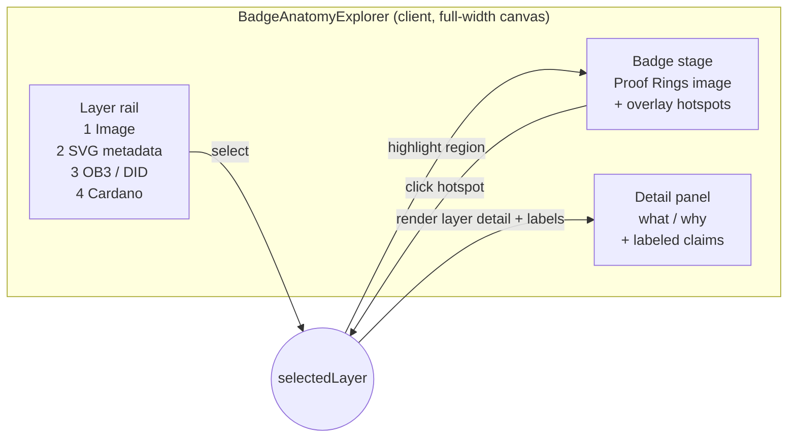

# feat: Interactive Badge Anatomy Explorer (full-width, non-scrolling)

## Summary

Turn the credential-badges anatomy page (`/docs/credential-badges`) from a prose stack into
a **full-width, non-scrolling interactive explorer**: a single isolated client component on
this page only, where a reader clicks through the four verified layers (Image → SVG metadata
→ OB3/DID → Cardano) and sees each layer's detail without scrolling. Every verified
`live` / `coming` / `in-dev` claim is preserved — reorganized into click-to-reveal panels,
not rewritten. The page keeps the docs sidebar + top nav (Fumadocs `full: true` gives the
content area full width and drops the right-hand TOC); the explorer fills the remaining
canvas. On small screens it degrades to a scrollable stack.

**Plan depth:** Standard. **Confirmed scope (in-session):** Level 1+2 — full-width + an
interactive component, keep sidebar/nav; layer-rail layout with synchronized badge highlight;
overlay hotspots on the static Proof Rings image (live inline-SVG region highlighting is a
deferred richer option).

---

## Problem Frame

The anatomy page is good and accurate, but it's a long prose read. James wants it to be a
"full-page single-page-app view that doesn't scroll — click around to understand the parts
of the badge," using the full page width. The content (four layers, honest labels, the real
Proof Rings badge) already exists and is verified; this is a **presentation/UX change**, not
a content or accuracy change.

Hard constraint carried from the page itself: **honesty is non-negotiable**. Every technical
claim must keep its true `live` / `coming` / `in-dev` label; an interactive re-presentation
must not drop, blur, or over-state any label.

Hard constraint from James: **do not destroy any other documentation pages.** The change must
be structurally isolated to this one page.

---

## Scope Boundaries

### In scope

- Full-width rendering for this page (`full: true`).
- A new isolated client component that presents the four layers as a non-scrolling,
  click-around explorer (rail + badge stage + detail panel), with synchronized highlight.
- Preserving all verified claims and their labels inside the explorer.
- A responsive fallback (scrollable stack) and baseline accessibility (keyboard, ARIA,
  reduced motion).

### Out of scope (non-goals)

- **Changing the verified facts, labels, or badge art.** Content is carried over as-is.
- **Removing the docs sidebar / top nav** (that was the rejected Level 3; this is Level 1+2).
- **Any change to the shared docs layout, the page renderer, or other pages.** Isolation is
  the point.

### Deferred to Follow-Up Work

- **Live inline-SVG region highlighting** — re-rendering the badge via the landing
  `buildBadgeSvg` core (copied in) so the actual rings/center light up, instead of overlay
  hotspots on the static image. Richer, but couples this page to the badge core; revisit if
  the overlay approach feels flat.
- **A true full-bleed no-chrome route** (Level 3) — only if the surviving sidebar proves
  unwanted.

---

## Key Technical Decisions

### KTD1 — Full width via `full: true` frontmatter (already wired)

The page renderer (`app/docs/[[...slug]]/page.tsx`) already reads `pageData.full` and passes
`<DocsPage full={pageData.full}>`; `full` is part of Fumadocs' base frontmatter schema that
`content-collections.ts` extends. So `full: true` on this page's frontmatter is a **one-line,
per-page** change that widens the content area and drops the TOC — **no code change, no other
page affected** (no other page sets it). *If `page.data.full` doesn't surface, the one-line
fallback is adding `full: z.boolean().optional()` to the schema's `.extend({})`.*

### KTD2 — One isolated client component, registered like `TreasuryVerifier`

Build `BadgeAnatomyExplorer` as a `"use client"` component following the
`components/protocol-info/TreasuryVerifier.tsx` precedent (documented header, props interface,
React hooks), registered in `mdx-components.tsx`, and used **only** on this page's MDX. This
guarantees isolation: nothing else imports it, so no other page can change.

### KTD3 — Layer-rail layout with synchronized badge highlight

The explorer is three regions: a **layer rail** (the four layers as selectable items), a
**badge stage** (the Proof Rings image with overlay hotspots), and a **detail panel** (the
selected layer's what/why + labeled claims). Selecting a layer in the rail, or clicking its
hotspot on the badge, drives one shared `selectedLayer` state — rail item, badge region, and
detail panel stay in sync. This is keyboard-and-screen-reader friendly (the rail is the
accessible control; hotspots are an enhancement), where badge-click-only navigation would not
be.

### KTD4 — Overlay hotspots on the static Proof Rings image

Position clickable hotspot regions (absolute-positioned over the existing
`public/images/credential-badges/credential-badge-sample.svg`, rendered inline or as a
background) mapped to the four layers' visual zones (outer ring, inner ring, center, an
"on-chain" affordance). No coupling to the badge generator. Live region-accurate highlighting
is deferred (Scope Boundaries).

### KTD5 — Non-scroll on desktop, scrollable stack on mobile

Desktop: the explorer fills a viewport-height canvas (`h-[calc(100svh-…)]`, internal
`overflow` only where a panel genuinely needs it) so the page itself doesn't scroll. Below a
breakpoint, the fixed canvas is abandoned for a normal vertical stack (badge, then each layer
as a section) — a fixed no-scroll canvas is hostile on small screens. Theme via Fumadocs
tokens (`fd-card`, `fd-border`, `fd-muted-foreground`, `fd-accent`) for light/dark parity.

---

## High-Level Technical Design

Three regions driven by one selection state; rail and badge hotspots are two inputs to the
same `selectedLayer`, and both the badge highlight and the detail panel are outputs of it.



Content model — the four layers as structured data the component renders (directional):

```
Layer = {
  id, title,
  what: string, why: string,
  claims: { text, label: 'live' | 'coming' | 'in-dev' }[],
  hotspot: { shape, coords }   // region on the badge
}
// seeded verbatim from the verified claims already in index.mdx — no new facts
```

---

## Implementation Units

### U1. Enable full-width canvas

**Goal:** Make this page render full-width (no TOC), confirming zero effect on other pages.

**Requirements:** "use the full width of the page"; isolation constraint.

**Dependencies:** none.

**Files:**
- `content/docs/credential-badges/index.mdx` (modify — add `full: true` to frontmatter).

**Approach:** Add `full: true`. Confirm the renderer already forwards it (KTD1); only touch
the schema if the flag doesn't surface.

**Patterns to follow:** Fumadocs `DocsPage` `full` prop; the existing
`app/docs/[[...slug]]/page.tsx` wiring (read-only reference — do not modify).

**Test scenarios:**
- `/docs/credential-badges` renders content full-width with no right-hand TOC; sidebar + top
  nav still present.
- A spot-checked other page (e.g. `/docs/protocol/v2/contract-verification`) is visually
  unchanged (still has its TOC) — proves per-page isolation.
- Test expectation: none beyond the two visual checks — pure frontmatter flag.

**Verification:** This page is full-width; another page is unchanged.

---

### U2. Extract the layer content model

**Goal:** Represent the four layers (title, what, why, labeled claims, hotspot) as structured
data, seeded verbatim from the verified claims in `index.mdx`.

**Requirements:** Preserve every `live`/`coming`/`in-dev` claim; four-layer structure.

**Dependencies:** none (can run alongside U1).

**Files:**
- `components/credential-badges/anatomy-layers.ts` (create — the typed layer model + data).

**Approach:** Define a `Layer` type (id, title, what, why, `claims: {text, label}[]`,
hotspot) and populate the four layers by lifting the exact prose and labels currently in the
page (Image, SVG metadata, OB3/DID, Cardano), including the `coming`/`in-dev` items (badge
baking, `did:web`, `evidence_hash`/andamioscan). No new facts.

**Patterns to follow:** the verified content in `content/docs/credential-badges/index.mdx`;
typed-data conventions like the interfaces in `TreasuryVerifier.tsx`.

**Test scenarios:**
- The model contains exactly four layers, each with non-empty what/why and at least one claim.
- Every claim carries a label of `live` | `coming` | `in-dev`; the set of claims matches the
  page (no label dropped or changed) — diff against `index.mdx` claim-by-claim.
- Test expectation: data module; correctness verified by the claim-parity check above.

**Verification:** A typed four-layer model whose claims+labels are a faithful copy of the
verified page.

---

### U3. Build the BadgeAnatomyExplorer component

**Goal:** The interactive explorer — rail + badge stage (with overlay hotspots) + detail
panel — driven by one `selectedLayer`, full-width and non-scrolling on desktop.

**Requirements:** "click around to understand the parts… doesn't scroll"; full-width;
synchronized highlight; preserve labels.

**Dependencies:** U2.

**Files:**
- `components/credential-badges/BadgeAnatomyExplorer.tsx` (create — `"use client"`).

**Approach:** Render the three regions (KTD3) from the U2 model. Shared `selectedLayer` state;
selecting a rail item or clicking a badge hotspot updates it; the badge highlight and detail
panel derive from it. Detail panel renders the layer's what/why and each claim with a visible
label chip. Desktop fills a viewport-height canvas (KTD5). Style with Fumadocs `fd-*` tokens
for light/dark. Document the component with a header comment like `TreasuryVerifier.tsx`.

**Execution note:** UI-quality work — verify visually with `ce-frontend-design` (screenshots),
not just by building. The repo has no JS unit-test runner.

**Patterns to follow:** `components/protocol-info/TreasuryVerifier.tsx` (client component
shape, header doc, props/types); `fd-*` theme tokens seen across `components/`.

**Test scenarios (verify via browser/visual + build):**
- Default state selects layer 1; rail, badge highlight, and detail panel agree.
- Clicking each rail item updates the badge highlight and swaps the detail panel to that
  layer's content.
- Clicking a badge hotspot selects the matching layer (bidirectional sync with the rail).
- Every label (`live`/`coming`/`in-dev`) from the model is visible in the rendered detail for
  its layer — spot-check the `coming` (badge baking, `did:web`) and `in-dev`
  (`evidence_hash`) items appear and are correctly labeled.
- On a desktop viewport the page does not scroll (canvas fits the viewport).

**Verification:** A working desktop explorer where rail, badge, and panel stay in sync, all
labels visible, no page scroll.

---

### U4. Responsive fallback + accessibility

**Goal:** Graceful small-screen behavior and baseline a11y.

**Requirements:** mobile degradation; keyboard/screen-reader usability.

**Dependencies:** U3.

**Files:**
- `components/credential-badges/BadgeAnatomyExplorer.tsx` (modify).

**Approach:** Below a breakpoint, drop the fixed canvas for a vertical scrollable stack (badge,
then each layer as a section — all content reachable). Make the rail keyboard-operable (arrow/
tab + Enter), give selected state an accessible name, add ARIA for the badge hotspots, and
respect `prefers-reduced-motion` for any highlight transition.

**Patterns to follow:** Tailwind responsive utilities already used in
`app/docs/[[...slug]]/page.tsx` (e.g. `xl:` breakpoints); standard ARIA tab/listbox semantics.

**Test scenarios (verify via browser/visual + build):**
- At a mobile width, the explorer becomes a scrollable stack and every layer's content +
  labels are reachable (nothing hidden behind a non-scrolling canvas).
- Keyboard: the rail is focusable and operable; selection changes via keyboard; focus is
  visible.
- `prefers-reduced-motion` disables or reduces the highlight animation.
- Screen-reader: each layer control has an accessible name; selected layer is announced.

**Verification:** Usable on mobile (scrollable, complete) and via keyboard/screen-reader.

---

### U5. Integrate into the page + register + verify

**Goal:** Replace the page's prose body with the explorer (keeping the intro + honesty
Callout), register the component, and verify the build.

**Requirements:** the explorer is the page; honesty Callout retained; build clean; isolation.

**Dependencies:** U1, U3 (U4 folds in when ready).

**Files:**
- `mdx-components.tsx` (modify — register `BadgeAnatomyExplorer`).
- `content/docs/credential-badges/index.mdx` (modify — keep frontmatter, intro paragraph, and
  the live/coming/in-dev honesty Callout; replace the four prose sections with
  `<BadgeAnatomyExplorer />`).

**Approach:** Keep the orientation intro and the honesty-legend Callout (they frame the page);
swap the long prose layers for the component. Retain the credential-badges nav entry and the
Module-3 badge asset. Confirm the page still compiles and is picked up by content-collections.

**Patterns to follow:** how `TreasuryVerifier` is imported/registered in `mdx-components.tsx`
and embedded in `contract-verification.mdx`.

**Test scenarios (verify via build + browser):**
- `npm run build` passes; `/docs/credential-badges` is present in
  `.content-collections/generated/allDocs.js` (guards the silent-frontmatter-drop trap).
- The rendered page shows the intro, the honesty Callout, and the interactive explorer.
- No other route changed (build output diff shows only this page affected).
- Test expectation: none new — this is the integration/verification gate.

**Verification:** Clean build; the page is the interactive explorer with its honesty framing
intact; nothing else changed.

---

## Requirements Traceability

| Request | Covered by |
|---|---|
| Use the full width of the page | U1 (KTD1) |
| Single-page-app view, click around the parts | U3, U2 (KTD3) |
| Doesn't scroll | U3, U5 (KTD5) |
| Don't destroy other documentation pages | U1/U5 isolation checks (KTD2) |
| Keep every verified live/coming/in-dev claim | U2, U3, U5 |
| Graceful on mobile / accessible | U4 (KTD5) |

---

## System-Wide Impact

- **Readers:** the page becomes interactive; the surviving sidebar lets them navigate back.
- **Other docs pages:** none — `full` is per-page, the component is imported only here, and the
  shared layout/renderer are untouched. U1 and U5 each include an explicit "other page
  unchanged" check.
- **Search/SEO:** content moves from MDX prose into a client component, so the static text
  available to the search index for this page shrinks. *Mitigation:* keep the intro + honesty
  Callout as real MDX text; the mobile stack also renders the full content. Note for review if
  search coverage of this page matters.

---

## Risks & Dependencies

- **Non-scroll vs. content overflow.** If a layer's detail exceeds the panel on a short
  viewport, content could be clipped. *Mitigation:* the detail panel scrolls internally; the
  *page* doesn't. Verify at a short desktop height.
- **Search-index shrinkage** (above) — flagged for the review gate.
- **No component test runner.** Verification is build + browser/visual (`ce-frontend-design` /
  `ce-test-browser`), not unit tests. Carry this posture into execution.
- **Hotspot mapping fidelity.** Overlay regions are approximate vs. the actual ring geometry;
  acceptable for v1 (KTD4), with live inline-SVG highlighting deferred.

**Dependencies:** the existing verified page + Proof Rings asset (present); Fumadocs `full`
support (confirmed wired); `mdx-components.tsx` registration.

---

## Sources & Research

- **In-session scoping** — confirmed Level 1+2, rail + synchronized highlight, overlay
  hotspots on the static image.
- **`andamio-docs`** — `app/docs/[[...slug]]/page.tsx` (`full` already forwarded),
  `content-collections.ts` (schema extends Fumadocs `frontmatterSchema`),
  `components/protocol-info/TreasuryVerifier.tsx` (client-component precedent),
  `mdx-components.tsx` (registration), `content/docs/credential-badges/index.mdx` (verified
  content to preserve), `fd-*` theme tokens, `docs/solutions/integration-issues/` (fumadocs
  gotchas).
- External research: not run — strong local patterns (client components, Fumadocs `full`),
  internal UI work; design quality handled by `ce-frontend-design` at build time.
