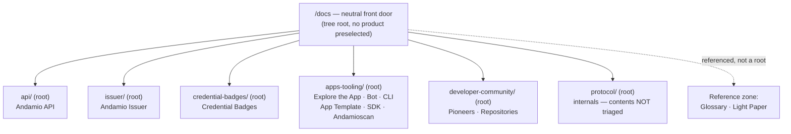
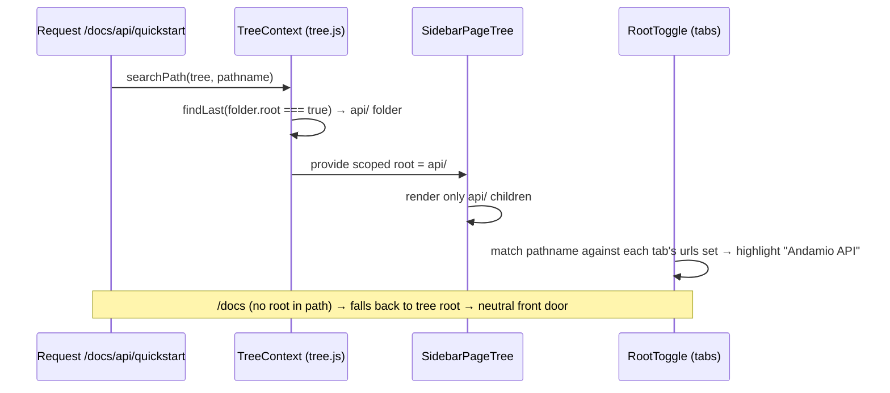

# feat: Docs Phase 2 IA — roadmap-aligned six-root spine

## Summary

Restructure the docs sidebar around **six product roots** that mirror the #28 Roadmap initiatives (API · Issuer · Credential Badges · Apps & Tooling · Developer Community · Protocol), replacing the flat front-door `meta.json` and the older `ecosystem/`+`app/` model in the governance plan. A mechanism spike proves Fumadocs root-scoping works before any content moves; content then migrates into `root: true` folders with a permanent redirect per moved URL. Two side quests ship independently: revising the governance docs to the six-root model, and adding an Issuer card to the home page.

## Problem Frame

The docs IA does not match how the product is described on the #28 Roadmap, and the checked-in Phase-2 plan (`.claude/skills/docs-governance/phase-2-ia-restructure.md`) targets an invented `ecosystem/`+`app/` structure with several still-open decisions. Meanwhile the live sidebar is a single flat tree with `--- separator ---` sections (`content/docs/meta.json`): there is no product scoping, so a reader in "Andamio API" sees the entire site. The roadmap-aligned decision is made (six roots, locked placements) — this plan is execution, not a re-open. It originates from the orch Phase-2 IA sign-off handoff (2026-06-29), which governs `.claude/skills/docs-governance/`.

The one real unknown the handoff names — *does a `root: true` folder plus auto-derived tabs actually scope the sidebar?* — is **de-risked by research** (see KTD1): Fumadocs scopes the tree automatically via `TreeContext`, independent of the tabs array. The spike still runs as a hard gate to confirm the behavior end-to-end before content churns.

---

## Requirements

### IA spine and scoping
- R1. The six sidebar roots mirror the #28 Roadmap initiative names: Andamio API, Andamio Issuer, Credential Badges, Apps & Tooling, Developer Community, Protocol.
- R2. Landing on `/docs` shows a neutral front door with **no product preselected** (the tree root, no `root: true` folder in the active path).
- R3. Entering any product root scopes the sidebar to that root's pages only; the root toggle (dropdown) lists all six roots and highlights the active one.
- R4. Cross-cutting content (Glossary, Light Paper) is surfaced in a front-door / Reference zone, **not** as roots, and stays woven per the locked papers decision (landing page remains the papers' artifact home).

### Content migration safety
- R5. Every moved URL has a `permanent: true` redirect in `next.config.mjs`, generated from a pre/post route diff.
- R6. No in-repo `/docs/...` link points at a moved-away URL after migration (the build does not catch these — content-collections silently 404s).
- R7. Path-hardcoded tooling continues to work: `npm run docs-coverage`, `npm run docs-drift`, and the audit skills that reference `content/docs/...` paths are updated to the new layout.
- R8. Search rebuilds from content and returns results for moved pages.

### Governance alignment
- R9. `docs-governance` SKILL.md, `phase-2-ia-restructure.md`, and `tool-registry.md` describe the six-root spine; the stale four-job / `ecosystem/`+`app/` model and the now-answered open decisions are removed.
- R10. Tool placements in `tool-registry.md` reflect: Andamio Bot · CLI · App Template · SDK · Andamioscan → Apps & Tooling; Pioneers · Repositories → Developer Community.

### Front door
- R11. The home page (`app/(home)/page.tsx`) shows an Issuer card alongside the existing entries so the front door matches the spine.

---

## Key Technical Decisions

- KTD1. **Tree scoping is automatic and independent of the tabs array — correcting the handoff's premise.** Fumadocs (`fumadocs-ui` 15.4.1) scopes the sidebar in `contexts/tree.js`: it runs `searchPath(tree, pathname)` then `path.findLast(item => item.type === 'folder' && item.root)` and renders only that folder's children. `RootToggle` + the `urls` set only drive the dropdown **selector and active-highlight** — they never filter the tree. Consequence: a folder with `root: true` already gets a scoped subtree today (protocol/ does). The handoff's "manual tabs carry no `urls` set so the tree isn't filtered" is imprecise — the tree filtering was never the tabs' job. The implementer should not hunt for a `urls`-based tree filter; it does not exist.
- KTD2. **Use auto-derived tabs, not a hand-call to `getSidebarTabs`.** Replace the hand-written `sidebar.tabs` array in `app/docs/layout.tsx` with `sidebar={{ tabs: true }}` (or omit the key). `DocsLayout` calls `getSidebarTabs(tree)` internally, walking the tree for `root: true` folders and computing each tab's `urls` set. This fixes dropdown correctness (all six roots listed, robust active-highlight) with no manual registry to maintain.
- KTD3. **Spike proves scoping across two roots before any content move.** Per the chosen approach, stand up a minimal `api/` root **alongside** the existing `protocol/` root and switch to auto-derived tabs. This proves (a) `/docs` neutral front door, (b) two independent roots each scope correctly, (c) the dropdown lists both — the closest proof to the real six-root end state. The spike is a **hard gate**: if scoping does not behave, stop and report before touching content.
- KTD4. **Tools move to Apps & Tooling, superseding the old "API → Tools" placement.** The prior governance put CLI/App Template/SDK/Andamioscan under API → Tools. The roadmap model places them under the **Apps & Tooling** root. The handoff is authoritative; the governance docs are reconciled to match (R10). Andamio Bot lives *inside* Apps & Tooling (it is an app on the roadmap), not a sold-product peer — preserving the "no tool is a product peer" principle.
- KTD5. **Redirects are generated from a route diff, not hand-listed.** Capture the route list before and after the move (e.g. from the built route manifest / a content-collections page enumeration) and emit one `permanent: true` redirect per delta. Hand-listing invites omissions; the existing `next.config.mjs` redirects block is the insertion point and already carries the `/docs/andamio-issuer` and `/docs/repositories/*` precedents.
- KTD6. **Protocol contents are out of scope.** This plan stands up the `protocol/` root (already `root: true`) but does not triage `protocol/v2/*` (state-machine, transactions, validators, tokens) or relocate the Understand cluster (`whats-new`, `cost-estimation`, `security-audit`). Those stay where they are for a separate workstream.

---

## High-Level Technical Design

Target sidebar spine (six roots; cross-cutting items are front-door references, not roots):

How a request resolves to a scoped sidebar (the mechanism from KTD1, unchanged by this work — only the set of `root: true` folders grows):

---

## Scope Boundaries

### In scope
- Six `root: true` folders, neutral front door, auto-derived tabs, content moves, redirects, link fixes, tooling updates, search verification, governance-doc revision, home-page Issuer card.

### Deferred to follow-up work
- Intra-`api/` and intra-`apps-tooling/` page-placement fine-tuning where soft (see content-move table notes on `building-on-andamio`, `demo`, `reference`). Reasonable calls are made here; revisit if they read wrong in situ.

### Out of scope (separate workstreams — do NOT do here)
- **Protocol deep triage** — contents of `protocol/v2/*` and the Understand cluster placement (`whats-new`, `cost-estimation`, `security-audit`). `security-audit`/contract-verification may later also surface under API, but that is decided in the triage, not here.
- **De-genericize the 45 token/validator stubs** — mostly under `protocol/v2/`, overlaps with the triage above.

---

## Content moves (today → target root)

Authoritative membership is the six-root spine; per-page placement below is execution detail. `(soft)` = reasonable call, revisit if wrong in situ.

| Today | Target |
|---|---|
| `content/docs/getting-started.mdx` | `api/` |
| `content/docs/guides/developers/*` (excl. `cli/`) | `api/` |
| `content/docs/guides/developers/api-quickstart` | `api/` (e.g. `api/quickstart`) |
| `content/docs/reference/` | `api/reference/` (soft) |
| `content/docs/building-on-andamio.mdx` | `api/` — conceptual intro (soft) |
| `content/docs/guides/courses`, `guides/projects`, `guides/contributors` | `apps-tooling/` (Explore the App path) |
| `content/docs/demo.mdx` | `apps-tooling/` (soft) |
| `content/docs/guides/developers/cli/` | `apps-tooling/` (CLI is an Apps & Tooling tool, not API) |
| `content/docs/sdk/` | `apps-tooling/` |
| Andamioscan · App Template · Andamio Bot (tool pages where they exist) | `apps-tooling/` |
| `content/docs/pioneers/` | `developer-community/` |
| `content/docs/repositories.mdx` | `developer-community/` |
| `content/docs/issuer/` | stays — add `root: true` |
| `content/docs/credential-badges/` | stays — add `root: true` |
| `content/docs/protocol/` | stays — already `root: true`, contents untouched |
| `content/docs/glossary.mdx`, `content/docs/light-paper.mdx` | stay top-level; surfaced in front-door Reference zone (no move) |

Tools without an existing page (Bot, App Template, Andamioscan if absent) are **registered** in the `apps-tooling/` meta and `tool-registry.md` only — no stub pages created here.

---

## Implementation Units

Units are phased: **Phase A** (U1–U2) is independent and ships first; **Phase B** (U3) is the gate; **Phase C** (U4–U9) runs only after the gate proves out.

### U1. Add Issuer card to the home page
- **Goal:** Front door matches the spine — Issuer is present alongside the existing paths (R11).
- **Requirements:** R11
- **Dependencies:** none (independent of all IA work)
- **Files:** `app/(home)/page.tsx`
- **Approach:** Add an Issuer entry to the `ENTRIES` array (title "Issuer", a one-line low-code-product body, `href: "/docs/issuer"`, a CTA). Four entries no longer fit `sm:grid-cols-3` cleanly — adjust the grid (e.g. `sm:grid-cols-2` for a 2×2, or `sm:grid-cols-4`) and renumber the `n` kickers. Keep the existing editorial token system (mono kicker, `font-display`, border-grid hover). Static/CSS-only; do not touch `/docs`.
- **Patterns to follow:** the existing `ENTRIES.map` card pattern and the `border-r`/`border-b` grid-line styling already in the file.
- **Test scenarios:** Test expectation: none (static presentational change). Verify visually: four cards render, the Issuer card links to `/docs/issuer`, the grid is balanced at `sm` and stacks on mobile.
- **Verification:** `npm run dev`, load `/`, confirm the Issuer card appears, links correctly, and the grid layout holds at mobile and `sm`+ widths.

### U2. Revise governance docs to the six-root spine
- **Goal:** `docs-governance` describes the six-root model; stale four-job / `ecosystem/`+`app/` content and answered open decisions are gone (R9, R10).
- **Requirements:** R9, R10
- **Dependencies:** none (documentation-only; independent of the mechanism)
- **Files:** `.claude/skills/docs-governance/SKILL.md`, `.claude/skills/docs-governance/phase-2-ia-restructure.md`, `.claude/skills/docs-governance/tool-registry.md`
- **Approach:** Reconcile, do not append.
  - SKILL.md — rewrite "Context: the spine the rules protect" and "The principle": the spine is now the six roadmap initiatives. Keep the principle that no single **tool** is a sold-product peer, but acknowledge two category/zone roots (Apps & Tooling, Developer Community) plus Credential Badges. The Bot lives *inside* Apps & Tooling.
  - `phase-2-ia-restructure.md` — replace the `ecosystem/`+`app/` target structure and content-move table with the six-root spine + the move table from this plan. Drop the now-answered open decisions (#2 App, #3 Bot, #4 glossary/papers). Mark the Understand cluster (#5) and all `protocol/` contents **out of scope — deferred to a separate Protocol deep-triage workstream**.
  - `tool-registry.md` — set Andamio Bot `Serves: Apps & Tooling` (move it out of "Unplaced"); set CLI / App Template / SDK / Andamioscan rows to Apps & Tooling; note Pioneers / Repositories under Developer Community.
- **Patterns to follow:** existing table shapes and the cross-links between the three governance files (keep them consistent after the rewrite).
- **Test scenarios:** Test expectation: none (skill/markdown docs, no runtime behavior). Cross-check: no remaining reference to `ecosystem/` or a standalone `app/` root; the three files agree on root names and tool placements.
- **Verification:** Re-read all three files; confirm internal links still resolve and no stale model survives.

### U3. Mechanism spike — prove dual-root scoping (HARD GATE)
- **Goal:** Demonstrate that `root: true` + auto-derived tabs scopes the sidebar, across two roots, with a neutral front door (R2, R3) — before any content moves.
- **Requirements:** R2, R3 (proof-of-mechanism)
- **Dependencies:** none; **blocks U4–U9**
- **Files:** `app/docs/layout.tsx`, `content/docs/api/meta.json` (new), `content/docs/api/index.mdx` (new, minimal), `content/docs/protocol/meta.json` (already `root: true` — no change expected)
- **Approach:** Replace the hand-written `sidebar.tabs` array with `sidebar={{ tabs: true }}` (auto-derive — KTD2). Stand up a minimal `api/` root: `content/docs/api/meta.json` with `{ "title": "Andamio API", "root": true, ... }` and a stub `index.mdx` plus one or two throwaway child pages so scoping is observable. Leave `protocol/` as-is. Do **not** move real content yet. After verifying, the stub `api/` either seeds U5 or is discarded — decide at U4.
- **Patterns to follow:** `content/docs/protocol/meta.json` as the `root: true` meta shape; `lib/source.ts` for how the tree is built (no change expected).
- **Test scenarios:**
  - Happy path: load `/docs` → neutral front door, no product preselected, dropdown shows roots without one being forced active.
  - Scoping: enter a `protocol/` page → sidebar shows only protocol children; enter the `api/` stub → sidebar shows only api children.
  - Dropdown: the root toggle lists both "Andamio API" and "Protocol" and highlights the one matching the current path (covers the `urls`-set highlight from KTD1).
  - Negative/gate: if entering a root does **not** scope the tree, treat as gate failure — stop and report rather than proceeding.
- **Verification:** `npm run dev`; manually walk the three scenarios above. Gate decision recorded: pass → proceed to Phase C; fail → stop and report (do not touch content).

### U4. Neutral front door + scaffold the six roots
- **Goal:** Convert the flat separator-based front door into a neutral front door plus six `root: true` folders ready to receive content (R1, R2, R4).
- **Requirements:** R1, R2, R4
- **Dependencies:** U3 (gate must pass)
- **Files:** `content/docs/meta.json`, `content/docs/api/meta.json`, `content/docs/apps-tooling/meta.json` (new), `content/docs/developer-community/meta.json` (new), `content/docs/issuer/meta.json`, `content/docs/credential-badges/meta.json`, `content/docs/protocol/meta.json`
- **Approach:** Rewrite `content/docs/meta.json` as a neutral front door: top-level entry points + a **Reference zone** that surfaces Glossary and Light Paper (which stay top-level, not roots — R4), dropping the `--- separator ---` product sections now owned by roots. Add `root: true` to `issuer/` and `credential-badges/` meta. Create `apps-tooling/` and `developer-community/` folders with `root: true` meta (titles "Apps & Tooling", "Developer Community") and an index page each. Promote the `api/` stub from U3 to a real root meta (or create it if discarded). Keep `protocol/` untouched.
- **Patterns to follow:** `content/docs/protocol/meta.json` (`root`, `icon`, `defaultOpen`); existing `content/docs/meta.json` link-item syntax (`[Label](/path)`, `--- separators ---`) for the front-door composition.
- **Test scenarios:**
  - Front door: `/docs` lists the six roots as entry points + the Reference zone (Glossary, Light Paper) with no product preselected.
  - Each new/flipped root folder appears in the auto-derived dropdown.
  - MDX integrity: after editing meta, confirm pages still resolve — `grep` the moved/affected slugs in `.content-collections/generated/allDocs.js` (content-collections silently drops invalid frontmatter → 404).
- **Verification:** `npm run dev`; `/docs` is neutral; all six roots show in the toggle; no console/build warnings about missing pages.

### U5. Move content into `api/`
- **Goal:** API developer content lives under the `api/` root (R1).
- **Requirements:** R1
- **Dependencies:** U4
- **Files:** moves of `content/docs/getting-started.mdx`, `content/docs/guides/developers/*` (excl. `cli/`), `content/docs/guides/developers/api-quickstart`, `content/docs/reference/`, `content/docs/building-on-andamio.mdx` into `content/docs/api/...`; plus `content/docs/api/meta.json` ordering.
- **Approach:** Relocate per the content-move table. Preserve each page's frontmatter exactly (em dashes fine; never `replace_all` across `---` fences — see CLAUDE.md MDX gotchas). Update `api/meta.json` page ordering. Record old→new URL pairs for U8 as you go.
- **Patterns to follow:** existing `guides/developers/meta.json` and `reference/meta.json` for sub-folder meta shape.
- **Test scenarios:**
  - Each moved page renders at its new URL and is scoped under `api/` in the sidebar.
  - `grep` each moved slug in `.content-collections/generated/allDocs.js` to confirm it was not silently dropped.
  - `building-on-andamio` and `reference` (the soft placements) read sensibly under `api/`.
- **Verification:** `npm run dev`; navigate each new `api/` URL; sidebar scopes to `api/`.

### U6. Move content into `apps-tooling/`
- **Goal:** Explore-the-App path and the Apps & Tooling tools live under `apps-tooling/` (R1, KTD4).
- **Requirements:** R1
- **Dependencies:** U4 (independent of U5; can land in parallel)
- **Files:** moves of `content/docs/guides/courses`, `guides/projects`, `guides/contributors`, `content/docs/demo.mdx`, `content/docs/guides/developers/cli/`, `content/docs/sdk/` into `content/docs/apps-tooling/...`; `content/docs/apps-tooling/meta.json` ordering and tool registrations (Bot / App Template / Andamioscan as links where no page exists).
- **Approach:** Relocate per the table. Note `cli/` is pulled out of `guides/developers/` (which otherwise goes to `api/` in U5) — sequence so the `cli/` move and the U5 developers move don't collide. For tools without pages, add registry entries / front-door links only (no stub pages). Record old→new URL pairs for U8.
- **Patterns to follow:** `content/docs/sdk/meta.json` and `guides/*/meta.json` for sub-meta; `tool-registry.md` placements from U2.
- **Test scenarios:**
  - Platform guides (courses/projects/contributors), `demo`, `cli`, and `sdk` render under `apps-tooling/` and scope correctly.
  - `cli/` no longer resolves under its old `guides/developers/` path (its redirect is verified in U8).
  - `grep` moved slugs in `.content-collections/generated/allDocs.js`.
- **Verification:** `npm run dev`; navigate the `apps-tooling/` subtree; sidebar scopes to `apps-tooling/`.

### U7. Move content into `developer-community/`
- **Goal:** Pioneers and Repositories live under `developer-community/` (R1, R10).
- **Requirements:** R1, R10
- **Dependencies:** U4 (independent of U5/U6)
- **Files:** moves of `content/docs/pioneers/` and `content/docs/repositories.mdx` into `content/docs/developer-community/...`; `content/docs/developer-community/meta.json` ordering.
- **Approach:** Relocate per the table. `pioneers/` carries its `live-coding/archive/...` subtree — move the whole folder and keep its internal meta intact. Record old→new URL pairs for U8 (note the existing `/docs/repositories/*` redirects already in `next.config.mjs` — they now point at the old `/docs/repositories`, which itself moves; chain or update them).
- **Patterns to follow:** `content/docs/pioneers/meta.json` and the live-coding archive meta structure (see CLAUDE.md Pioneers archival section — paths there will need updating in U9).
- **Test scenarios:**
  - Pioneers archive index and session pages render under `developer-community/` and scope correctly.
  - Repositories page renders under `developer-community/`.
  - Existing `/docs/repositories/on-chain/*` etc. redirects still resolve (now via a chain to the new location).
  - `grep` moved slugs in `.content-collections/generated/allDocs.js`.
- **Verification:** `npm run dev`; navigate the `developer-community/` subtree; confirm old repository sub-URLs still redirect.

### U8. Redirects for every moved URL
- **Goal:** No moved URL 404s for external/inbound links (R5).
- **Requirements:** R5
- **Dependencies:** U5, U6, U7 (all moves complete)
- **Files:** `next.config.mjs`
- **Approach:** Generate a pre/post route diff (KTD5) — enumerate routes before the moves (from a clean build / content-collections page list captured at U4) and after, diff to get every changed URL. Add a `permanent: true` redirect per delta into the existing `redirects()` array. Reconcile the pre-existing `/docs/andamio-issuer` and `/docs/repositories/*` entries with the new structure (the repositories ones now need to chain to `developer-community/`). Use wildcard `:slug*` patterns where a whole folder moved.
- **Patterns to follow:** the existing `redirects()` block in `next.config.mjs` (wildcard `:slug*`, `permanent: true`).
- **Test scenarios:**
  - For a sample of moved URLs across all three roots, requesting the old URL 308-redirects to the new one.
  - Folder-wildcard moves (e.g. `guides/developers/*`, `sdk/*`, `pioneers/*`) redirect their children, not just the index.
  - Pre-existing redirects still terminate at a live page (no redirect loops, no chains to a 404).
- **Verification:** Build, then curl/load a sampled set of old URLs and confirm each lands on the new page; check for loops.

### U9. Fix in-repo links, path-hardcoded tooling, and verify search
- **Goal:** Internal links, tooling, and search all work post-migration (R6, R7, R8).
- **Requirements:** R6, R7, R8
- **Dependencies:** U5, U6, U7 (and ideally U8 for redirect cross-checks)
- **Files:** any `content/docs/**/*.mdx` with `/docs/...` links to moved pages; `package.json` scripts / scripts behind `docs-coverage` and `docs-drift`; `.claude/skills/**` and `.claude/CLAUDE.md` references to moved `content/docs/...` paths (e.g. the Pioneers archival paths); search config if it pins paths.
- **Approach:** `grep` the repo for `/docs/<moved>` links and `content/docs/<moved>` path references and update to new locations (the build will not catch stale `/docs/...` links — content-collections silently 404s). Update `npm run docs-coverage` / `docs-drift` and the audit skills to the new tree. Update CLAUDE.md's Pioneers archival paths and the V2 docs path references. Rebuild and verify search returns moved pages.
- **Patterns to follow:** existing audit-skill path references; the `audit-docs` skill for how coverage/drift resolve paths.
- **Test scenarios:**
  - `grep` shows zero `/docs/<old-path>` links remaining in `content/docs/`.
  - `npm run docs-coverage` and `npm run docs-drift` run without path errors.
  - Search (`app/api/search/`) returns results for at least one moved page in each root.
  - Spot-check internal cross-links from protocol/credential-badges pages into moved targets still resolve.
- **Verification:** Run both `npm run` audit scripts; exercise search for moved pages; click through a sample of internal links.

---

## Risks & Dependencies

- **Redirect omissions / SEO** — a missed moved URL 404s for inbound links. Mitigation: generate redirects from a route diff (KTD5), not by hand; sample-test across all roots (U8).
- **Silent 404s from content-collections** — invalid frontmatter or stale links drop pages with no build error. Mitigation: `grep .content-collections/generated/allDocs.js` after every move (U5–U7) and `grep` for stale `/docs/...` links (U9).
- **`cli/` move collision** — `cli/` leaves `guides/developers/` (→ `api/`) for `apps-tooling/`; sequence U5/U6 so the parent-folder move and the child extraction don't clobber each other.
- **Redirect chains** — the existing `/docs/repositories/*` redirects target a path that itself moves; risk of chains or loops. Mitigation: reconcile them in U8 and test for loops.
- **Tooling drift** — `docs-coverage`/`docs-drift` and audit skills hardcode `content/docs/...`; they silently mis-scan if not updated (U9, R7).
- **Gate dependency** — U4–U9 must not start until U3 proves scoping. If U3 fails, stop and report; the restructure does not proceed.
- **Fumadocs version pin** — findings are against `fumadocs-ui`/`fumadocs-core` 15.4.1; the tabs/RootToggle API has shifted across versions. A future upgrade could change auto-derive behavior.

---

## Sources & Research

- **Origin:** orch Phase-2 IA sign-off handoff (2026-06-29) — "Docs Phase 2 IA, roadmap-aligned six-root spine." Governs `.claude/skills/docs-governance/`.
- **Mechanism (KTD1/KTD2), verified in `node_modules` at v15.4.1:**
  - `fumadocs-ui/dist/contexts/tree.js` — `searchPath` + `findLast(folder.root === true)` scopes the tree (the actual filter).
  - `fumadocs-ui/dist/utils/get-sidebar-tabs.js` — walks the tree for `root: true` folders, builds each tab's `urls` Set via `getFolderUrls`.
  - `fumadocs-ui/dist/components/layout/root-toggle.js` — uses `urls` only for dropdown active-highlight; does not filter the tree.
  - `fumadocs-ui/dist/layouts/docs/shared.js` — `sidebar.tabs: true | undefined` auto-derives; an array is used verbatim.
- **Current state:** `app/docs/layout.tsx` (hand-written tabs), `content/docs/meta.json` (flat separators), `content/docs/protocol/meta.json` (`root: true` already), `next.config.mjs` (existing redirects block), `lib/source.ts` (tree loader).
- **Governance to revise:** `.claude/skills/docs-governance/{SKILL.md,phase-2-ia-restructure.md,tool-registry.md}`.
- **MDX gotchas (CLAUDE.md):** content-collections silently drops invalid-frontmatter files; never `replace_all` across `---` fences; verify via `.content-collections/generated/allDocs.js`.
