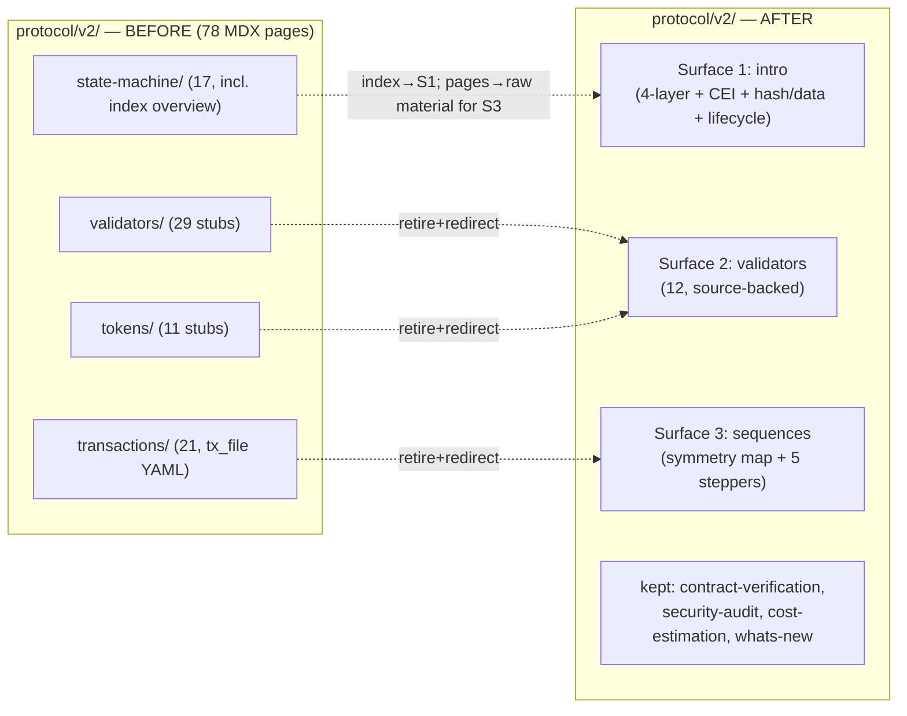
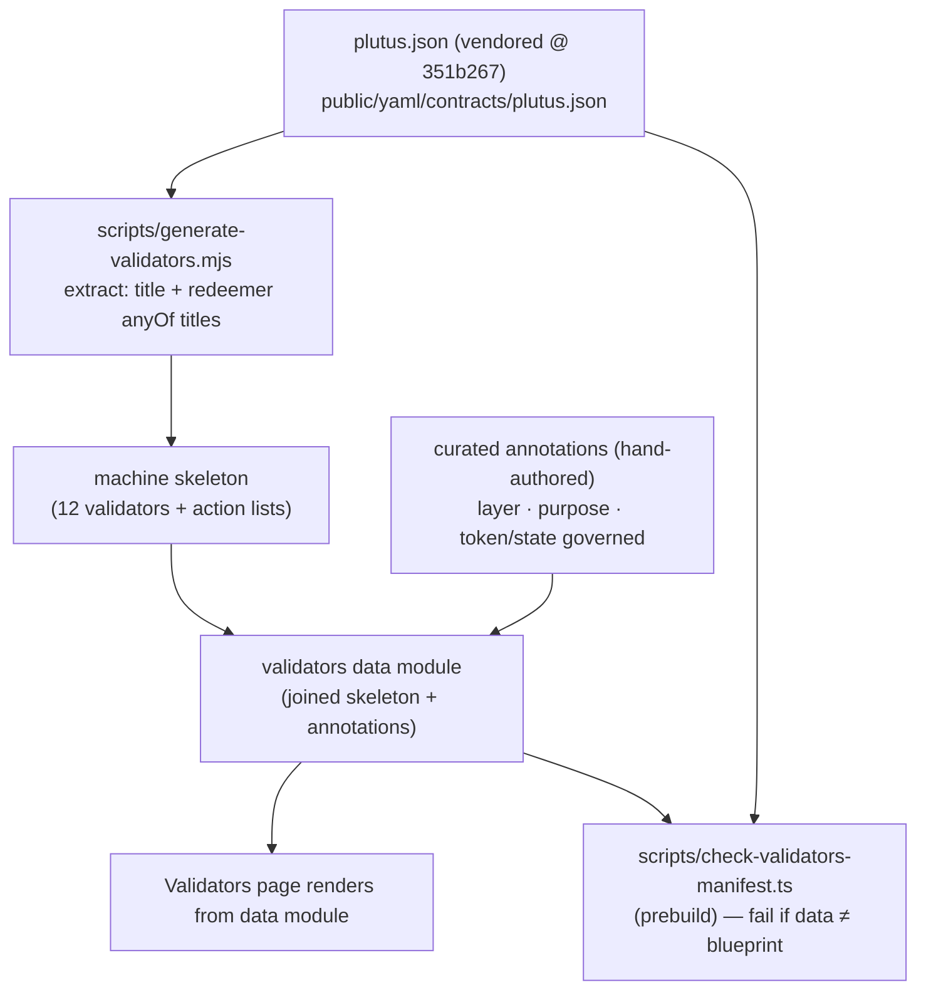
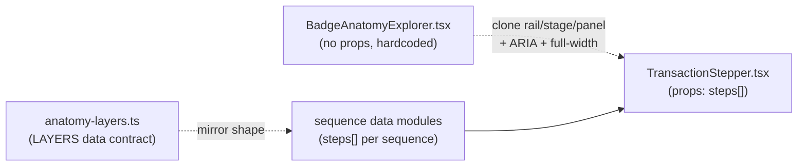

# feat: Protocol docs redesign — intro · source-backed validators · transaction-sequence steppers

> **Origin:** `orch/docs/plans/2026-06-29-protocol-docs-redesign-handoff.md` (a self-contained, design-decided handoff). Design is settled; this is execution. **Target repo:** `andamio-docs`. All paths below are repo-relative to `andamio-docs/`.
> **Validator source of truth:** `andamio-aiken-contracts` `plutus.json` @ `351b267` (on-chain code is immutable/deployed — current).

---

## Summary

The current `content/docs/protocol/v2/` is four sprawling, partly-stale trees (78 MDX pages — transactions 21, validators 29, tokens 11, state-machine 17; ~88 routes counting landings/meta): a 21-page `transactions/` tree generated from out-of-date `tx_file` YAML, ~40 sub-65-word `validators/` + `tokens/` stubs from a 2025 auto-gen experiment, and a `state-machine/` tree whose `index` architecture overview is probably inaccurate. The protocol section is overdone and competes with the API/Issuer products instead of supporting them.

This plan replaces the four trees with **three honest surfaces**:
1. **Protocol intro** — one hand-written page: the four-layer model + the two keepers from the old overview (hash-on-chain/data-off-chain, CEI), plus the generic transaction lifecycle factored out once.
2. **Validators** — one page generated/curated from a pinned `plutus.json` so it cannot drift: 12 validators across 4 layers, each token explained inline in its validator's entry.
3. **Transaction sequences** — interactive steppers for 5 essential workflows + a course↔project symmetry-map overview, built on a reusable component cloned from the badge-anatomy explorer pattern (PR #39).

The four old trees are retired (tx YAML archived, not shipped), every removed URL gets a permanent redirect, the tree-coupled auto-injection in the docs page renderer is decoupled, and the build + search are re-verified.

---

## Problem Frame

**Who is affected:** developers evaluating or integrating Andamio (the protocol section should build credibility and point them at the products, not bury them in stale anatomy pages), and the docs maintainers (the auto-gen trees drift silently against the live contracts and API).

**Why now:** the Phase 2 six-root IA (commits `2a0518a`, `20633ca`) put `protocol` under "Explore & build" as a support surface. The content underneath it has not been brought in line — it still reads as a competing reference product. The handoff is the deep-triage verdict that resolves this.

**Core tension this plan resolves:** the validators/transactions content must be *accurate and low-maintenance*. The old approach (hand-transcribed stubs, YAML-generated anatomy pages) drifts the moment contracts or the API change. The fix is to (a) generate the validators surface from the compiled blueprint with a build-time drift guard, and (b) re-compose the hand-written `state-machine/*` request/response material into task-oriented sequences rather than per-transaction anatomy.

---

## Requirements

Traced to the handoff's **Done when** checklist:

- **R1 — Surface 1 (intro).** A single hand-written intro page presents the four-layer model (Global registry → Instances → Course → Project), the CEI pattern, hash-on-chain/data-off-chain, and ONE shared transaction-lifecycle explainer (build → sign → submit → register → confirm → update). It replaces both `protocol/v2/index` and `state-machine/index`.
- **R2 — Surface 2 (validators).** One page renders the **12 validators** across 4 layers, with each validator's authorized actions sourced mechanically from `plutus.json` (no hand-transcription). Each token is explained inline in the validator that mints/burns it. The `tokens/` stub tree is gone.
- **R3 — Surface 3 (sequences).** A symmetry-map overview (Course/Project, five shared beats) plus interactive steppers for the 5 essential sequences, built on the reused badge-explorer pattern. The generic lifecycle is linked once (to Surface 1), never repeated per step.
- **R4 — Retire + redirect.** `transactions/`, `validators/`, `tokens/`, and the old `state-machine/` overview are retired; the `tx_file` YAML is archived (not shipped); every removed URL redirects; no stale in-repo links remain; `next build` is green; search is re-verified.
- **R5 — Understand-cluster placement (resolved).** Per James: `security-audit` + `contract-verification` **stay in Protocol** for now (API relocation deferred); `cost-estimation` + `whats-new` stay as light Protocol pages; marketing-flavored content is **not** folded into the intro. (See [Scope Boundaries](#scope-boundaries).)

---

## Key Technical Decisions

- **KTD-1 — Surface 2 is generated from a *vendored, pinned* blueprint, not a live cross-repo pull.** `plutus.json` lives in `andamio-aiken-contracts` (another repo). We copy it into `andamio-docs` at a pinned rev and generate from the copy. "A contract change regenerates the page" means: re-vendor the blueprint, re-run the script, commit the diff. This matches the repo's existing source-data pattern (`scripts/generate-v2-tx-docs.mjs` reads vendored `public/yaml/` data) and avoids a fragile build-time dependency on a sibling repo. *(see origin: "wire this from the live `plutus.json` … the compiled blueprint is the source — do not hand-transcribe")*
- **KTD-2 — Machine-extracted skeleton + hand-curated annotations, joined, with a drift guard.** The blueprint gives the *mechanical* facts: `validators[].title` → validator name; `redeemer.schema.$ref` → `definitions[].anyOf[].title` → action list (verified: this reproduces the handoff's 12-validator table exactly). The *curated* facts — layer assignment, one-line purpose, which token/state each governs — are hand-authored and cannot come from the blueprint. The two are joined in a single data module; a `prebuild` guard fails the build if the curated module's validator set or action lists diverge from the blueprint (modeled on `scripts/check-contract-manifest.ts`). This is what makes "cannot drift" real.
- **KTD-3 — Steppers reuse the explorer *pattern*, not the component verbatim.** `components/credential-badges/BadgeAnatomyExplorer.tsx` takes no props — its content is hardcoded and its data lives in `anatomy-layers.ts`. Reuse means cloning its **rail** (ARIA tablist, roving tabindex, Arrow/Home/End) and **detail-panel** structure into a new **data-driven** `TransactionStepper` that accepts a `steps[]` prop, plus a per-sequence data module mirroring `anatomy-layers.ts`. **Caveat (feasibility):** the explorer's middle **stage** column is image-and-hotspot specific (`aspect-square` badge canvas + `hotspot.{x,y}`-positioned buttons) and does **not** transfer — it is ~1/3 of the component and must be built net-new as a sequence-position visualization (a step track). The rail + panel carry all the content; budget the stage as new work and ship a minimal step-track first. The `full:true` frontmatter auto-applies the `max-w-none` full-width pairing (the renderer already gates it on `full`). *(see origin: "reusing the badge-anatomy explorer component")*
- **KTD-4 — Re-compose, don't re-research.** The hand-written `state-machine/*` pages hold the request/response raw material (endpoints, costs, datums, CEI applications). The sequence steppers re-compose this existing material into Actor → Transaction → on-chain effect → resulting state beats. No new transaction analysis.
- **KTD-5 — Build new surfaces before retiring old trees.** Redirects need live destinations and the new pages must exist before the old ones are deleted, so Phase A (new surfaces) completes before Phase B (retire + redirect). Avoids a window of 404s. **Exception — validators slug collision:** Surface 2's page (`validators.mdx`) and the old `validators/index.mdx` both compute the slug `protocol/v2/validators`. Because the `docs` collection glob is `**/*.mdx`, both ingest and one silently shadows the other. So the `validators/` *deep tree* must be deleted **in U3, coupled to the new page's creation** — not deferred to Phase B. Every other retirement is safely deferrable because the new surfaces land at *different* paths (`index` rewrite, new `sequences/`).
- **KTD-6 — Decouple the slug-pattern auto-injection.** `app/docs/[[...slug]]/page.tsx` conditionally injects `TransactionDiagram` / `ValidatorDiagram` / `ValidatorInfo` / `TokenInfo` etc. based on URL-slug patterns tied to the deep trees (e.g. `slug.startsWith("protocol/v2/validators/") && slug.length >= 5`). Collapsing the trees strands this logic — it becomes dead code that can mis-fire on new pages. It must be removed or re-guarded as part of retirement, not left behind.

---

## High-Level Technical Design

### IA: four trees → three surfaces



### Surface 2 data flow (generation + drift guard)



### Component reuse



> Directional guidance for reviewers — not implementation specification.

---

## Output Structure

New and modified files (illustrative; per-unit `**Files:**` are authoritative):

```
andamio-docs/
├── content/docs/protocol/v2/
│   ├── index.mdx                      # U1  rewritten — Surface 1 intro
│   ├── meta.json                      # U8  rewritten — new sidebar order
│   ├── validators.mdx                 # U3  rewritten — single source-backed page
│   ├── sequences/                     # U6/U7 NEW — Surface 3
│   │   ├── index.mdx                  #   symmetry-map overview
│   │   ├── meta.json
│   │   ├── onboarding.mdx
│   │   ├── course-author-operate.mdx
│   │   ├── course-learn-earn.mdx
│   │   ├── project-author-operate.mdx
│   │   └── project-contribute-earn.mdx
│   ├── contract-verification.mdx      # kept (unchanged)
│   ├── security-audit.mdx             # kept (unchanged)
│   ├── cost-estimation.mdx            # kept (unchanged)
│   ├── whats-new.mdx                  # kept (unchanged)
│   ├── transactions/ validators/(tree) tokens/ state-machine/   # U8 DELETED
├── components/protocol/
│   ├── TransactionStepper.tsx         # U5  NEW — reusable stepper (cloned pattern)
│   └── sequences/                     # U6  NEW — per-sequence data modules
│       ├── types.ts
│       ├── onboarding.ts … project-contribute-earn.ts
├── public/yaml/contracts/
│   ├── plutus.json                    # U2  NEW — vendored, pinned @ 351b267
│   └── PINNED-REV.md                  # U2  NEW — records source rev + re-vendor steps
├── content/docs/protocol/v2/_archive/ # U8  NEW — archived tx_file YAML (not shipped)
├── scripts/
│   ├── generate-validators.mjs        # U2/U3 NEW — blueprint → data module
│   └── check-validators-manifest.ts   # U4  NEW — prebuild drift guard
├── mdx-components.tsx                  # U5  modified — register TransactionStepper
├── app/docs/[[...slug]]/page.tsx       # U10 modified — decouple slug auto-injection
├── next.config.mjs                     # U9  modified — retirement redirects
└── package.json                        # U2/U4 modified — docs-validators script + prebuild
```

> The tree is a scope declaration, not a constraint — the implementer may adjust layout (e.g. whether the validators data lives in `components/protocol/` vs `lib/`) if implementation reveals a better fit. Per-unit `**Files:**` remain authoritative.

---

## Implementation Units

### Phase A — Build the three new surfaces

### U1. Surface 1 — Protocol intro page

- **Goal:** Replace `protocol/v2/index` with a single hand-written intro covering the four-layer model, CEI, hash-on-chain/data-off-chain, and the one shared transaction-lifecycle explainer that Surface 3 will link to.
- **Requirements:** R1.
- **Dependencies:** none. (Do first — it provides the lifecycle anchor U6 links to.)
- **Files:**
  - `content/docs/protocol/v2/index.mdx` (rewrite)
  - Reuse content from `content/docs/protocol/v2/state-machine/index.mdx` (raw material — lifecycle, CEI table, hash/data table, Mermaid diagrams) and the four-layer framing from the handoff.
- **Approach:** Re-compose, don't rewrite from scratch. The existing `state-machine/index.mdx` already has accurate CEI, hash/data, and the BUILD→SIGN→SUBMIT→REGISTER→CONFIRM→UPDATE lifecycle with Mermaid diagrams — lift those sections. Add the four-layer model (Global registry → Instances → Course → Project) as the opening frame. Keep it concise and accurate; this is the protocol's front door, written to *support* the API/Issuer products (link out to them), not compete. Do **not** fold in marketing/paper content (per R5). The shared lifecycle section needs a stable anchor (e.g. `#transaction-lifecycle`) so steppers can deep-link it once.
- **Patterns to follow:** existing `state-machine/index.mdx` for `<Mermaid>` / `<Callout>` / `<ThemedImage>` usage; Fumadocs frontmatter (`title`, `description`, `icon`).
- **Test scenarios:**
  - `Test expectation: none — content page, no behavioral logic.` Verified via U11 (renders, in nav, anchor resolves, no broken links). The lifecycle section exposes a stable heading anchor that U6 stepper pages link to.
- **Verification:** Page renders at `/docs/protocol/v2`; the four-layer model, CEI, hash/data, and a single lifecycle explainer are present; the lifecycle heading has a linkable anchor; no remaining content asserts the old (inaccurate) architecture overview.

### U2. Surface 2 — Vendor pinned blueprint + extraction script

- **Goal:** Bring `plutus.json` into the repo at a pinned rev and produce a script that mechanically extracts the validator/action skeleton.
- **Requirements:** R2.
- **Dependencies:** none.
- **Files:**
  - `public/yaml/contracts/plutus.json` (new — copied from `andamio-aiken-contracts` @ `351b267`)
  - `public/yaml/contracts/PINNED-REV.md` (new — records the source repo, rev `351b267`, date, and the re-vendor procedure)
  - `scripts/generate-validators.mjs` (new — extraction half; rendering half lands in U3)
  - `package.json` (add a `docs-validators` script entry)
- **Approach:** Mirror `scripts/generate-v2-tx-docs.mjs` (config block, `--dry-run`/`--verbose`, `js-yaml`/JSON reads). The extractor walks `validators[]`, dedupes on `title.split('.')[0]` (12 unique names from 29 purpose-suffixed entries), resolves each `redeemer.schema.$ref` through `definitions[]` to its `anyOf[].title` action list. Output an intermediate machine-skeleton object keyed by validator name. Note `middleware.ts` already serves `/yaml/*` with CORS/cache headers, so the vendored file is also web-reachable if needed.
- **Patterns to follow:** `scripts/generate-v2-tx-docs.mjs` (source-data → output generator); `scripts/check-contract-manifest.ts` (path constants, `js-yaml` usage).
- **Test scenarios:**
  - Happy path: running the extractor against `public/yaml/contracts/plutus.json` yields exactly 12 validators with the expected action lists (e.g. `global_state` → MintLocalState · BurnLocalState · DeleteState · ChangeUserInfo · MoveState; `escrow1` → Deny · Refuse · Accept · UserAction).
  - Edge case: a validator whose redeemer `$ref` resolves to a non-`anyOf` schema (e.g. a single-constructor or opaque type) is handled gracefully (emits an empty/sentinel action list, not a crash) — `global_state_ref` → `NewGlobalRefPair` confirms single-constructor handling.
  - Edge case: the 29→12 dedupe is exact (no validator dropped, no purpose-suffixed duplicate leaking through).
  - Error path: a missing or malformed `plutus.json` exits non-zero with a clear message rather than producing partial output.
- **Verification:** `npm run docs-validators -- --dry-run` prints the 12 validators and their action lists matching the handoff table; no write occurs in dry-run.

### U3. Surface 2 — Validators page (curated data + rendering, tokens inline)

- **Goal:** Render one Validators page from the joined machine-skeleton + curated annotations, with each token explained inline in its validator's entry.
- **Requirements:** R2.
- **Dependencies:** U2.
- **Files:**
  - `scripts/generate-validators.mjs` (extend — join skeleton with curated annotations, emit the data module and/or MDX)
  - a curated annotations source + joined data module (e.g. `components/protocol/validators-data.ts` or `public/yaml/contracts/validators-annotations.json` → generated `*-data.ts`) — implementer's call per KTD-2
  - `content/docs/protocol/v2/validators.mdx` (rewrite — single page; renders the 12 grouped by 4 layers)
  - **Delete `content/docs/protocol/v2/validators/` deep tree here** (29 stub MDX + meta), coupled to creating `validators.mdx` — per the KTD-5 slug-collision exception. (The other trees are deleted in U8.)
- **Approach:** Hand-author the curated annotations (layer ∈ {Global registry, Instances, Course, Project}; one-line purpose; the token/state minted/burned) keyed by validator name. The generator joins curated + skeleton — failing loudly if a curated key has no blueprint match or vice versa (this is the join contract the U4 guard also enforces). The page presents each layer as a section and each validator as an entry: name · layer · purpose · actions (from blueprint) · token/state governed. Per-validator entry = the handoff's spec. **Render path:** prefer a typed data module that `validators.mdx` **imports directly** and maps over — MDX in this repo does real ESM imports (e.g. `content/docs/apps-tooling/demo.mdx`), so the data module needs **no** `mdx-components.tsx` registration (registration is only for bare un-imported `<Tag/>`). This mirrors the explorer's data/render split and is testable. **Slug-collision guard:** because `validators.mdx` and the old `validators/index.mdx` collide on slug `protocol/v2/validators`, delete the `validators/` tree in the same change (above) and confirm `grep "'protocol/v2/validators'" .content-collections/generated/allDocs.js` shows exactly one entry — the new page, not the old stub.
- **Patterns to follow:** `anatomy-layers.ts` (typed data module exported as an array, imported by an MDX page and mapped over). *(Note: `scripts/docs-coverage-check.ts` targets a non-existent `protocol/v1` tree and a missing registry — it is pre-broken and unrelated to Surface 2; do not model against it.)*
- **Test scenarios:**
  - Happy path: the page lists all 12 validators grouped under their 4 layers; each shows its blueprint-sourced action list and its inline token/state note.
  - Edge case: a curated annotation referencing a validator absent from the blueprint fails generation (join contract) rather than rendering a phantom entry.
  - Edge case: a blueprint validator with no curated annotation fails generation (no silent omission) — guarantees all 12 are covered.
  - Integration: tokens that were previously their own stub pages (e.g. `course-state-v2-token`, `contributor-state-v2-token`, access token) appear inline in the correct validator entry, so retiring `tokens/` loses no information.
- **Verification:** `/docs/protocol/v2/validators` renders 12 validators across 4 layers, actions match the blueprint, every former token stub's substance is represented inline; `grep 'protocol/v2/validators' .content-collections/generated/allDocs.js` confirms the page built (frontmatter valid).

### U4. Surface 2 — Prebuild drift guard + npm wiring

- **Goal:** Make "cannot drift" real: a `prebuild` guard fails the build if the curated validators data diverges from the vendored blueprint.
- **Requirements:** R2, R4 (build green).
- **Dependencies:** U3.
- **Files:**
  - `scripts/check-validators-manifest.ts` (new — drift guard)
  - `package.json` (add to the `prebuild` chain alongside `check-doc-headings`, `check-contract-manifest`, `check-treasury-reference`)
- **Approach:** Model on `scripts/check-contract-manifest.ts` (one-directional assertion, exit 1 with a pointer to the offender, runs in `prebuild`). Assert: every validator name and every action in the rendered/curated data still appears in the blueprint's extracted skeleton, AND every blueprint validator is present in the data (bidirectional for completeness, since a missing validator is a real regression here — unlike the manifest guard which is intentionally one-way). Failure message points at the specific validator/action mismatch and tells the maintainer to re-run `npm run docs-validators` after re-vendoring.
- **Execution note:** Start with a failing guard test — author a fixture where the curated data is missing an action the blueprint has, assert the guard exits non-zero, then implement until it passes.
- **Patterns to follow:** `scripts/check-contract-manifest.ts` (`fail()` helper, `process.exit(1)`, `prebuild` integration); `scripts/check-treasury-reference.ts`.
- **Test scenarios:**
  - Happy path: with curated data matching the blueprint, the guard exits 0 silently.
  - Error path: curated data missing a validator the blueprint defines → exit 1 naming the missing validator.
  - Error path: curated data listing an action not in the blueprint → exit 1 naming the stray action.
  - Error path: curated data with a validator the blueprint doesn't have → exit 1 (phantom validator).
  - Integration: `npm run build` fails fast (in `prebuild`) when the blueprint and data disagree, before `next build` runs.
- **Verification:** Introducing a deliberate mismatch fails `npm run build` in the prebuild step with a clear pointer; reverting restores a green build.

### U5. Surface 3 — Reusable TransactionStepper component + data contract

- **Goal:** Clone the badge-explorer rail/stage/panel + ARIA pattern into a data-driven stepper component that accepts a `steps[]` prop, and define the per-step data contract.
- **Requirements:** R3.
- **Dependencies:** none (can build in parallel with U1–U4). U6/U7 depend on it.
- **Files:**
  - `components/protocol/TransactionStepper.tsx` (new — `"use client"`, props-driven)
  - `components/protocol/sequences/types.ts` (new — `Step` / `Sequence` types)
  - `mdx-components.tsx` (register `TransactionStepper` in `getMDXComponents`)
- **Approach:** Lift the **rail and detail-panel** structure from `components/credential-badges/BadgeAnatomyExplorer.tsx`: desktop `lg:grid` inside a bounded non-scrolling canvas; rail as ARIA `tablist` with roving tabindex + Arrow/Home/End (`onRailKeyDown`); detail panel as `role="tabpanel"`; mobile collapse to a scrollable stack; Fumadocs theme tokens (`fd-border`, `fd-card`, `fd-accent`). **Key change:** accept content via props (`steps: Step[]`, plus sequence title/intro) instead of importing a hardcoded module. Per-step grammar (the handoff's): Actor → Transaction → on-chain effect (validator action + token Δ) → resulting state, plus the step's build endpoint. **The middle "stage" column does NOT clone** — the original's badge-image-and-hotspot canvas is image-specific and has no analogue in `Step`. Build it net-new as a sequence-position visualization (a step track / progress rail); ship a minimal version first, degrade gracefully, keep it decorative so the accessible rail+panel carry all content. The generic lifecycle is **not** re-rendered per step — each step's detail panel links once to the Surface 1 lifecycle anchor.
- **Technical design (directional):** `Step { id, n, actor, transaction, validatorAction, tokenDelta, resultingState, buildEndpoint?, link? }`; `Sequence { id, title, intro, steps: Step[] }`. The component is the render half; data modules (U6) are the content half — same split as `BadgeAnatomyExplorer` ↔ `anatomy-layers`.
- **Patterns to follow:** `BadgeAnatomyExplorer.tsx` (ARIA tablist, `useId`, `useRef` tab refs, keyboard handler, full-width `lg:h-[min(78vh,760px)]` canvas); the `full:true` + `max-w-none` pairing from `app/docs/[[...slug]]/page.tsx`.
- **Test scenarios:**
  - Happy path: given a `steps[]` of N, the rail renders N tabs; selecting a tab updates the detail panel to that step's actor/transaction/effect/state.
  - Edge case: keyboard nav — ArrowDown/Right advances and wraps, ArrowUp/Left retreats and wraps, Home/End jump to first/last; focus follows selection (roving tabindex).
  - Edge case: a step with no `buildEndpoint`/`link` renders without an empty link affordance.
  - Edge case: mobile breakpoint renders the scrollable stack with all steps reachable (no content hidden behind the desktop-only canvas).
  - Integration: ARIA wiring — `role=tablist`/`tab`/`tabpanel`, `aria-selected` tracks selection, `aria-controls`/`aria-labelledby` pair the panel to the active tab (mirrors the verified-accessible explorer).
- **Verification:** Component renders from a sample `steps[]` in a scratch page; keyboard + SR semantics match the explorer; registered in `mdx-components.tsx` so MDX can use `<TransactionStepper .../>`.

### U6. Surface 3 — The five sequence stepper pages

- **Goal:** Author the 5 essential sequences as data modules + stepper pages, re-composed from the existing `state-machine/*` raw material.
- **Requirements:** R3.
- **Dependencies:** U5 (component), U1 (lifecycle anchor to link).
- **Files:**
  - `components/protocol/sequences/onboarding.ts`
  - `components/protocol/sequences/course-author-operate.ts`
  - `components/protocol/sequences/course-learn-earn.ts`
  - `components/protocol/sequences/project-author-operate.ts`
  - `components/protocol/sequences/project-contribute-earn.ts`
  - `content/docs/protocol/v2/sequences/{onboarding,course-author-operate,course-learn-earn,project-author-operate,project-contribute-earn}.mdx`
  - `content/docs/protocol/v2/sequences/meta.json`
  - Raw material (read, don't edit): `content/docs/protocol/v2/state-machine/{general,course,project}/*.mdx`
- **Approach:** Each data module encodes the sequence's steps in the U5 grammar, grounded in validator actions (from Surface 2 / blueprint) + build endpoints (from the `state-machine/*` pages). The five sequences and their anchoring actions (from the handoff):
  1. **Onboarding** — Mint Access Token (`global_state: MintLocalState`).
  2. **Course · Author & operate** — Create Course → Manage Modules (`module_scripts: MintModule`) → Manage Teachers (`instance_governance`).
  3. **Course · Learn & earn** — Commit to Assignment (`course_state: CommitAssignment`) → Update evidence (`assignment_validator: StudentAction`) → Teacher Assesses (`assignment_validator: Accept`) → Claim Credential.
  4. **Project · Author & operate** — Create Project → Manage Managers → Manage Tasks (`treasury: Manage`) → Add Funds (`treasury: CommitFunds`).
  5. **Project · Contribute & earn** — Commit to Task (`contributor_state: CommitProject`) → do work → Manager Assesses (`escrow1: Accept` + `contributor_state: AddCompleted`) → Claim Credential.
  Each MDX page is thin: frontmatter (`full: true`) + intro + `<TransactionStepper steps={...} />`. Full width is automatic — `full: true` frontmatter is all that's needed (the docs renderer at `app/docs/[[...slug]]/page.tsx` already applies `max-w-none` when `full` is set); no per-page wiring. Each step's detail links once to the Surface 1 lifecycle anchor instead of repeating it.
- **Patterns to follow:** `anatomy-layers.ts` (verbatim-from-verified-source discipline — re-shape existing accurate content, add no new facts); `content/docs/credential-badges/index.mdx` (`full:true` + component invocation).
- **Test scenarios:**
  - Happy path (per sequence): the data module's steps match the handoff's sequence; validator actions cited exist in the Surface 2 blueprint data; build endpoints match the corresponding `state-machine/*` page.
  - Edge case: cross-references — every step's lifecycle link resolves to the Surface 1 anchor (U1); no step re-embeds the generic lifecycle.
  - Edge case: each sequence page sets `full:true` and renders edge-to-edge (not capped at 1120px).
  - Integration: `grep` each new page in `.content-collections/generated/allDocs.js` to confirm valid frontmatter (no silent 404).
- **Verification:** All 5 stepper pages render with correct, source-grounded steps; actions trace to the blueprint; endpoints trace to `state-machine/*`; lifecycle linked once each.

### U7. Surface 3 — Course↔Project symmetry-map overview

- **Goal:** One overview page that teaches the whole protocol — two columns (Course / Project) aligned on the shared five-beat shape (Create, Populate, Commit, Assess, Claim), each cell linking into its sequence stepper.
- **Requirements:** R3.
- **Dependencies:** U6 (the steppers it links into).
- **Files:**
  - `content/docs/protocol/v2/sequences/index.mdx` (new — the symmetry map; also the `sequences/` landing so the directory URL resolves)
  - `content/docs/protocol/v2/sequences/meta.json` (created in U6; ensure `index` first)
- **Approach:** Render the handoff's two-column five-beat map (Create / Populate / Commit / Assess / Claim × Course / Project) — a 2×5 grid of 10 cells, each linking into the relevant beat of the matching sequence stepper (U6 sequences 2–5 cover the Course/Project beats; the **Onboarding** sequence is the precondition that sits *above* the grid, not a grid cell). See the origin handoff for the exact beat layout. This is the navigational entry point to Surface 3 and the single view that orients a reader to the course/project symmetry. Could be a simple responsive grid/table or a small presentational component — keep it lightweight (no need for the full stepper here).
- **Patterns to follow:** Fumadocs `index.mdx` landing convention (a directory URL only resolves with an `index.mdx` — see the fumadocs-broken-directory-links learning); existing `*/index.mdx` landings.
- **Test scenarios:**
  - Happy path: the overview shows both columns aligned on all five beats; every cell links to a real stepper page.
  - Edge case: `/docs/protocol/v2/sequences` (directory URL) resolves to this index, not a 404.
  - Integration: all intra-map links resolve to the U6 pages (verified in U11 link audit).
- **Verification:** `/docs/protocol/v2/sequences` renders the symmetry map; every cell navigates to its stepper; appears in the sidebar.

### Phase B — Retire old trees, redirect, decouple

### U8. Retire the four trees + archive tx YAML + rewrite sidebar

- **Goal:** Remove `transactions/`, `validators/` (deep tree), `tokens/`, and the old `state-machine/` overview; archive the `tx_file` YAML (not shipped); rewrite `protocol/v2/meta.json` to the new order.
- **Requirements:** R4.
- **Dependencies:** U1, U3, U6, U7 (new destinations must exist first — KTD-5).
- **Files:**
  - Delete: `content/docs/protocol/v2/transactions/` (21 mdx + meta), `content/docs/protocol/v2/tokens/` (11 stubs), `content/docs/protocol/v2/state-machine/` (17 pages — the `index` is replaced by U1; the `course/`/`project/`/`general/` pages were raw material for U6 and are retired once re-composed)
  - **Note:** `content/docs/protocol/v2/validators/` (deep tree) was already deleted in **U3** (slug-collision exception, KTD-5) — it is *not* deferred here.
  - Archive: move the `tx_file` YAML out of the shipped tree to `content/docs/protocol/v2/_archive/` (or `docs/_archive/` outside `content/` so content-collections ignores it) — confirm it is not picked up by the `docs` collection glob
  - `content/docs/protocol/v2/meta.json` (rewrite `pages`: `index`, `validators`, `sequences`, then kept light pages `contract-verification`, `security-audit`, `cost-estimation`, `whats-new`)
- **Approach:** This is the destructive step — sequence it after Phase A. Decide the `state-machine/*` raw-material pages' fate: they are retired (their substance now lives in U1 + U6). Confirm the archive location is excluded from the `**/*.mdx` content glob so archived YAML/MDX never publishes. Before deleting, grep the repo for in-repo links into each retired path so U10 can fix them. **Per the broken-directory-links learning:** treat each MDX + its `meta.json` as an atomic pair; after the rewrite, the build's page count is the safety net for silently-dropped pages.
- **Patterns to follow:** the fumadocs-broken-directory-links learning (`docs/solutions/integration-issues/fumadocs-broken-directory-links.md`) — directory URLs need an `index.mdx`; verify links against `ls`.
- **Test scenarios:**
  - `Test expectation: none — content removal + nav config.` Behavioral verification is U11 (build page-count delta matches expected removals; no orphaned `meta.json` entries; archived YAML absent from `.content-collections/generated/allDocs.js`).
- **Verification:** The four trees are gone from `content/docs/protocol/v2/`; `meta.json` lists only the new + kept pages in order; archived YAML exists outside the published collection; `next build` page count reflects the intended deletions (no accidental extra losses).

### U9. Permanent redirects for every removed URL

- **Goal:** Every retired URL redirects to its best new home; no dangling 404 for a previously-published path.
- **Requirements:** R4.
- **Dependencies:** U8 (final removed paths + destinations known).
- **Files:** `next.config.mjs` (extend the `async redirects()` array)
- **Approach:** Add `{ source, destination, permanent: true }` entries. Mapping: `transactions/:path*` → `sequences` (or the specific stepper where an obvious 1:1 exists); `validators/:path*` → `validators`; `tokens/:path*` → `validators` (tokens now inline); `state-machine/:path*` → `index` (intro) for the overview, and to the matching `sequences/*` stepper where a state-machine page maps onto a sequence. **Respect source-order specificity** (the existing file's header comment: specific sources must precede broader parents — e.g. a specific `state-machine/course/student-credential-claim` rule before `state-machine/:path*`). Generate the list from a pre/post route diff (the precedent used for the six-root move).
- **Patterns to follow:** existing `next.config.mjs` `redirects()` entries (wildcards, `permanent: true`, ordering comment).
- **Test scenarios:**
  - Happy path: `GET /docs/protocol/v2/transactions/course/student/assignment/commit` 308-redirects to its new home; `/docs/protocol/v2/validators/project/escrow1` → `/docs/protocol/v2/validators`; `/docs/protocol/v2/tokens/...` → `/docs/protocol/v2/validators`.
  - Edge case: order — a specific `state-machine/*` rule resolves before the broad `state-machine/:path*` parent (no shadowing).
  - Edge case: a bare retired directory URL (e.g. `/docs/protocol/v2/transactions`) also redirects, not just deep paths.
  - Error path: no retired path resolves to a 404 (cross-checked against the U8 pre-deletion route list).
- **Verification:** Spot-check representative retired URLs in `npm run dev` / a built server — each redirects to a live destination; ordering verified for the `state-machine` specific-before-parent case.

### U10. Remove dead slug auto-injection + fix stale in-repo links

- **Goal:** Remove the now-fully-dead slug-pattern auto-injection block in the docs page renderer, and fix every stale in-repo link to a retired path — **without** deleting components that have a live non-docs consumer.
- **Requirements:** R4, KTD-6.
- **Dependencies:** U8 (and U3) — all v2 trees gone.
- **Files:**
  - `app/docs/[[...slug]]/page.tsx` (remove the conditional injection block keyed on `protocol/v1|v2/validators/`, `…/tokens/`, `tx_file`)
  - In-repo MDX/TS referencing retired paths (found via grep in U8) — repoint to the new surfaces
- **Approach (corrected by feasibility review):** The injection block's conditions key on `protocol/v1/...` (no `v1` tree exists — already dead) and `protocol/v2/{validators,tokens}/` with `slug.length >= 5`. After U3+U8 delete those v2 trees, **the entire block is dead** — and it could never have mis-fired on the new pages anyway (`protocol/v2/validators` has slug length 3; `sequences/*` doesn't match). So remove the conditional block **wholesale**; there are **no surviving pages that still need injection** (the earlier "confirm which, if any" resolves to: none). **Do NOT delete the imported components** `TokenInfo`, `ValidatorInfo`, `DiagramValidatorOverview`, `TxYamlMetadata`, `TransactionDiagramClient` — they have a **live consumer**: the standalone non-docs route `app/validators/[system]/[validatorId]/page.tsx` (and `TokenInfo` is referenced by `components/react-flow/transactions/utils/tokenUtils.ts`). Remove only the now-unused *imports* in `page.tsx`, not the component files. Then grep `content/docs/` and `components/` for links into `protocol/v2/{transactions,validators/<deep>,tokens,state-machine}` and repoint them (the `anatomy-layers.ts` link to `/docs/protocol/v2/contract-verification` stays — that page is kept). Watch for stale temporal/status prose per the pdf-static-asset learning. **Out of scope here:** the standalone `app/validators/` route is a stale parallel surface to the retired validators tree — retiring it is deferred follow-up (see Scope Boundaries), not part of this unit.
- **Patterns to follow:** `app/docs/[[...slug]]/page.tsx` current injection structure; the nextjs-fumadocs-pdf learning's "grep for cross-references + fix stale text" checklist.
- **Test scenarios:**
  - Happy path: a `sequences/*` page and the `validators` page render with no injected `ValidatorDiagram`/`TokenInfo` components.
  - Edge case: `app/validators/[system]/[validatorId]/page.tsx` still builds and renders — the shared components it imports were not deleted.
  - Error path: `next build` resolves with no dangling import to a removed module (only the dead `page.tsx` imports were dropped, not the component files).
  - Integration: full-repo grep for the retired path prefixes returns only redirect entries (in `next.config.mjs`) and archive paths — no live in-repo links.
- **Verification:** `next build` resolves cleanly; the docs renderer no longer carries the injection block; the standalone `app/validators/` route still builds; grep confirms no stale links remain.

### Phase C — Verify

### U11. Build-green + search + link/coverage verification

- **Goal:** Prove the redesign is whole: build green, search re-indexed, every link resolves, page count matches intent.
- **Requirements:** R1–R4 (the verification half of "Done when").
- **Dependencies:** U1–U10.
- **Files:** none (verification).
- **Approach:** Run the full gate: `npm run build` (exercises the `prebuild` guards: `check-doc-headings`, `check-contract-manifest`, `check-treasury-reference`, and the new U4 `check-validators-manifest`) → green. Confirm the page-count delta matches the intended deletions/additions (the broken-directory-links learning's safety net). Verify search (`app/api/search/`) returns the new surfaces and not the retired pages (re-index happens at build; confirm the new pages are queryable and stale ones are gone). Walk the redirect spot-checks (U9). Confirm `grep` of `.content-collections/generated/allDocs.js` includes all new pages (valid frontmatter) and excludes archived content. *(Do **not** rely on `npm run docs-coverage` / `scripts/docs-coverage-check.ts` — it targets a non-existent `protocol/v1` tree and a missing `validator-registry-v1.yaml`, so it already errors and is unrelated to Surface 2. The real Surface 2 gate is the U4 drift guard + the allDocs grep.)*
- **Execution note:** Single-build hygiene (per the full-width-page learning) — never run parallel `next build`/`next start`; if `.next` corrupts (`ENOENT`/`PageNotFoundError`), `pkill -f next`, `rm -rf .next`, rebuild clean.
- **Test scenarios:**
  - Happy path: `npm run build` exits 0 with all four prebuild guards (headings, contract-manifest, treasury, validators) passing.
  - Edge case: search index includes `protocol/v2` intro, `validators`, and all 5 `sequences/*` pages; excludes retired tree pages.
  - Edge case: `docs-coverage-check.ts` passes against the new single-page validators surface (updated expectations if needed).
  - Integration: every internal link across `content/docs/` resolves (no link into a retired path that lacks a redirect); page count = expected.
- **Verification:** Build green; search verified; all links resolve; coverage check passes; the handoff's "Done when" checklist is fully satisfiable.

---

## Scope Boundaries

### In scope
- The three new surfaces (intro, source-backed validators, sequence steppers + symmetry map).
- Retirement of the four trees with redirects; archive (not ship) the `tx_file` YAML.
- Decoupling the tree-coupled slug auto-injection; fixing stale in-repo links.
- Build-green + search + link verification.

### Deferred to Follow-Up Work
- **Reorganizing the kept Understand-cluster pages.** Per James: do the full Protocol update first; *then* consider moving `security-audit` / `contract-verification` (and possibly `cost-estimation`) out of Protocol — likely toward an integrator/API-facing home. Not in this branch. (If moved later, note `contract-verification.mdx` carries a `prebuild` drift guard `scripts/check-contract-manifest.ts` pinned to its path — relocating the page requires updating that script's `DOC_PATH`.)
- **Automating a cross-repo blueprint pull.** Surface 2 uses a *vendored, pinned* `plutus.json` re-vendored by hand (KTD-1). A live `andamio-aiken-contracts` → `andamio-docs` sync hook is a separate enhancement.
- **Retiring the standalone `app/validators/[system]/[validatorId]/` route.** This is a non-docs Next.js route that renders per-validator diagram pages parallel to the retired validators tree — it keeps `DiagramValidatorOverview`/`ValidatorInfo` alive (so U10 must not delete those components). It is now stale, but it sits outside `content/docs/` and outside the handoff's scope. Decide its fate (retire vs keep) in a follow-up; U10 only stops referencing the shared components from the *docs* renderer.

### Out of scope (separate cleanup, flagged by James)
- **Moving the Andamio papers out of docs.** James: the papers (`content/docs/light-paper.mdx`, `content/docs/andamio-issuer.mdx`, and similar marketing-level material) "should only live on the landing page and no longer in the docs … not documentation." That is a separate content-governance cleanup touching files outside `protocol/v2/` and is not part of this redesign. This plan only honors the *adjacent* implication: **do not fold marketing/paper content into the new Surface 1 intro** (R5).

---

## Risks & Dependencies

| Risk | Impact | Mitigation |
|---|---|---|
| Content-collections **silently drops** MDX with invalid frontmatter (404, no build error) | New surfaces or steppers appear missing | After each MDX change, `grep '<path>' .content-collections/generated/allDocs.js`; treat MDX+meta.json as an atomic pair (project CLAUDE.md + broken-directory-links learning) |
| Retiring trees leaves the **slug auto-injection** in `app/docs/[[...slug]]/page.tsx` fully dead | Confusing dead code; its imported components have a *live* consumer (`app/validators/` route) and must not be deleted | U10 removes the block wholesale but keeps the shared components; the standalone route is deferred (Scope Boundaries); U11 confirms both renderers build |
| **Validators slug collision** — `validators.mdx` and old `validators/index.mdx` share slug `protocol/v2/validators` | New Surface 2 silently shadowed during Phase A | U3 deletes the `validators/` tree coupled to the new page (KTD-5 exception), then greps `allDocs.js` for a single entry |
| **Stale vendored blueprint** drifts from deployed contracts | Validators page silently wrong | U4 prebuild drift guard fails the build on divergence; `PINNED-REV.md` records the re-vendor procedure |
| **Redirect ordering** — broad `:path*` parents shadow specific rules | Some retired URLs land on the wrong destination | U9 orders specific-before-parent (existing `next.config.mjs` convention); U11 spot-checks the `state-machine` specific case |
| Reusing badge art / explorer naively | Stale shield art or wrong reuse | KTD-3 reuses the *pattern* (no badge art); the stepper "stage" is a sequence visualization, not a vendored image (credential-badge-art-source-of-truth learning) |
| Parallel `next build` corrupts `.next` | Spurious `PageNotFoundError` during verification | Single-build hygiene in U11 (fumadocs-full-width-page learning) |
| **No documented redirect/retirement pattern** in `docs/solutions/` | Future maintainers repeat the figuring-out | Capture a `/compound` learning after this lands (bulk doc-tree retirement + redirect + search re-verify) |

**External dependency:** `andamio-aiken-contracts` `plutus.json` @ `351b267` — vendored, not live. On-chain code is immutable/deployed, so the pin is current; re-vendor only when contracts redeploy.

---

## Sources & Research

- **Origin handoff:** `orch/docs/plans/2026-06-29-protocol-docs-redesign-handoff.md` (design-decided; this plan is its execution).
- **Blueprint (verified):** `andamio-aiken-contracts/plutus.json` @ `351b267` — extraction confirmed 12 validators and action lists matching the handoff table exactly (`validators[].title` → name; `redeemer.schema.$ref` → `definitions[].anyOf[].title` → actions).
- **Reuse target:** `components/credential-badges/BadgeAnatomyExplorer.tsx` + `components/credential-badges/anatomy-layers.ts` (rail/stage/panel + ARIA + data/render split); registered via `mdx-components.tsx`; full-width pairing in `app/docs/[[...slug]]/page.tsx`.
- **Generation precedents:** `scripts/generate-v2-tx-docs.mjs` (source-data → MDX), `scripts/check-contract-manifest.ts` (prebuild drift guard). *(`scripts/docs-coverage-check.ts` is **not** a usable precedent — it targets a non-existent `protocol/v1` tree and a missing `validator-registry-v1.yaml`, and is not in the `prebuild` chain; it already errors and is unrelated to this work.)*
- **Raw material for sequences:** `content/docs/protocol/v2/state-machine/{index,general,course,project}/*.mdx` (hand-written request/response, costs, CEI).
- **Redirects:** `next.config.mjs` `async redirects()` (wildcards, `permanent:true`, specific-before-parent ordering).
- **Institutional learnings:** `docs/solutions/integration-issues/fumadocs-broken-directory-links.md` (directory URLs need `index.mdx`; build page-count as safety net), `docs/solutions/integration-issues/nextjs-fumadocs-pdf-static-asset-serving.md` (new-section checklist; grep cross-refs + stale text), `docs/solutions/workflow-issues/docs-release-sync-drift-2026-05-20.md` (generate concepts/flows, point at live Scalar for schemas; route drift by path), plus auto-memory `credential-badge-art-source-of-truth` and `fumadocs-full-width-page`.
- **Gap to compound after landing:** no documented pattern for bulk doc-tree retirement + redirects + post-restructure search verification.
