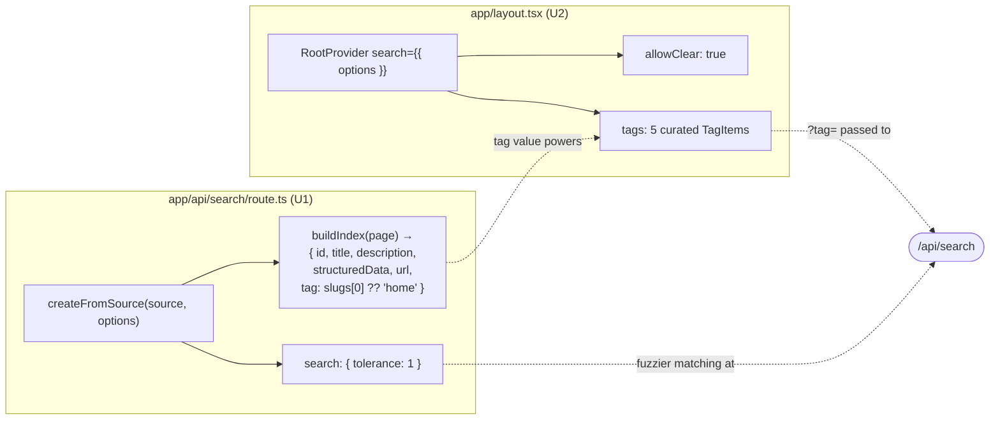

# feat: Tune the built-in Orama docs search (typo tolerance + section tag scoping)

## Summary

Docs search is 100% stock fumadocs with zero tuning, which the 2026-06-29 team review flagged as weak — people don't reliably find the right page. This plan applies the two native Orama levers that close most of the gap, at $0 / always-fresh / no new dependency:

1. **Typo & partial-word tolerance** so "treasry" / "validador" return the right page.
2. **Section tagging + a curated tag filter** in the ⌘K dialog so a query can be scoped to API / Issuer / Apps & Tooling / Protocol / Credential Badges instead of competing against every sidebar root.

Acronym/synonym findability (e.g. "SLT" → "Student Learning Target") is a deliberate lighter follow-on and stays out of scope here (see Scope Boundaries). Algolia DocSearch is a deliberate *later* adoption decision, not part of this work (see origin).

All work lands in two files — `app/api/search/route.ts` (index) and `app/layout.tsx` (dialog) — plus a manual QA + team-review screenshot deliverable.

---

## Problem Frame

Search today is a plain token-match Orama index built by `createFromSource(source)` with no options. For a jargon-heavy protocol-docs site this produces three structural gaps (origin "Why"):

- **No typo / partial-word tolerance** — Orama defaults to exact token match after stemming, so a single-character typo or partial word returns nothing.
- **No scoping** — every query searches all sidebar roots flat, so the right page competes with noise from unrelated sections.
- **No synonym / acronym mapping** — a literal token must be on the page for it to match.

This plan fixes the first two (the structural wins). The third is content-level and deferred.

The cause is structural (zero tuning), not a bug, so the fix is configuration of the existing engine — no engine swap, no external service.

---

## What's verified in the repo (2026-06-30)

Research confirmed the origin's claims **and** resolved its main open uncertainty (the exact option nesting), which had shifted across fumadocs minors. Verified against the installed packages, not docs:

- `fumadocs-core` and `fumadocs-ui` are both **`15.4.1`** (installed, confirmed in `node_modules`).
- `app/api/search/route.ts` is the one-line stock index: `export const { GET } = createFromSource(source);`. Next **server mode** (no static export), so the dynamic route handler is the index source.
- `app/layout.tsx` wraps the app in `<RootProvider>` with **no `search` prop** — stock ⌘K dialog, no tag bar.
- `content/docs/index.mdx` exists at the docs root; its `page.slugs` is empty (no root segment) — so a tag derived from `page.slugs[0]` is `undefined` for the home page and must be defaulted.
- Sidebar roots (from `content/docs/meta.json`, the natural tag set): `api`, `issuer`, `apps-tooling`, `credential-badges`, `developer-community`, `protocol`, `contract-verification`, `security-audit`, `glossary`.

**API-shape correction (the load-bearing research finding).** The origin doc guessed search params "nest under the locale config." The installed `15.4.1` types show otherwise — `createFromSource(source, options)` takes `options` of type `Options<Page>` which extends `Omit<AdvancedOptions, 'indexes'>` and adds `buildIndex`. Confirmed shape:

- `options.language?: string` (top-level, via `SharedOptions`)
- `options.search?: Partial<SearchParams>` (top-level) — Orama `SearchParams` includes **`tolerance`** and **`threshold`** (verified in `@orama/orama` types; `threshold` defaults to `0`).
- `options.buildIndex?: (page) => AdvancedIndex` — `AdvancedIndex` requires `id, title, structuredData, url`; optional `description, keywords, tag`. The `tag` field doc-comment reads *"Required if tag filter is enabled."*

Client side, `<RootProvider search={{ options }}>` accepts `options: Partial<DefaultSearchDialogProps>`, whose tag-relevant fields are `tags?: TagItem[]`, `defaultTag?: string`, and `allowClear?: boolean` (default `false`). `TagItem = { name: string; value: string }`.

> These verified names replace every "confirm the nesting" hedge in the origin. The implementer follows the shapes above; no version archaeology needed at implementation time.

---

## Key Technical Decisions

| Decision | Choice | Rationale |
|---|---|---|
| Engine | Keep native Orama; tune via options | $0, always-fresh, no infra/dependency; gets most of the gap for this corpus size. Algolia is a separate later decision (see origin). |
| Tolerance | `tolerance: 1` | Levenshtein distance 1 catches the common single-char typo / partial word. The team's complaint is **misses, not noise** — start conservative; only try `2` if real queries still fail. |
| Threshold | Leave at default (`0`) | Lower it only if partial-term pages should surface more aggressively. Tune by feel against real queries, not preemptively. |
| Tag source | `page.slugs[0]`, defaulted to `'home'` for the root page | The root slug is the natural section. `index.mdx` has empty slugs, so it needs an explicit fallback to avoid an `undefined` tag (origin gotcha). |
| Visible tag set | Curate to 5 (API, Issuer, Apps & Tooling, Protocol, Credential Badges); leave the rest indexed-but-unbarred | A 9-toggle bar is clutter. These five are the sections people actually scope to. `developer-community`, `contract-verification`, `security-audit`, `glossary` stay fully searchable with no tag selected. (origin "Tag UX nuance") |
| Default scope | No default tag (`allowClear: true`) | Search-everything by default; the user opts into a scope. Matches origin intent. |

---

## High-Level Technical Design

Two coordinated edits across the index/dialog seam. The `tag` field is the contract between them — the server must emit it for the client filter to function.

The `tag` emitted by `buildIndex` (U1) is what the dialog's tag bar (U2) filters on. U2 is inert without U1's tag field; ship in order.

---

## Implementation Units

### U1. Tune the server-side search index — tolerance + section tag

**Goal:** Replace the stock one-line index with a tuned `createFromSource` call that adds typo tolerance and a per-page section `tag`.

**Requirements:** origin "What to change" §1 (tolerance) and §2 (tag the index).

**Dependencies:** none.

**Files:**
- `app/api/search/route.ts` (modify)

**Approach:**
- Pass an options object to `createFromSource(source, options)` with:
  - `language: 'english'` (single-language site)
  - `search: { tolerance: 1 }` — leave `threshold` unset (default `0`)
  - `buildIndex(page)` returning `{ id: page.url, title, description, structuredData, url: page.url, tag }` where `tag = page.slugs[0] ?? 'home'`
- Use the verified `15.4.1` shapes in "What's verified in the repo" — `search` and `buildIndex` are top-level options, not nested under locale. Follow the installed types over any older snippet if they ever diverge.
- Keep the default index fields intact (title/description/structuredData) so nothing drops out of the index; the only additions are the tuned `search` and the `tag`.

**Patterns to follow:** the existing `import { source } from '@/lib/source'` wiring; `AdvancedIndex` field names from `fumadocs-core/dist/search/server.d.ts`.

**Test scenarios** (manual — no search test harness in repo; run `npm run dev` and exercise `/api/search` via the ⌘K dialog):
- Covers origin Verification. Typo query "treasry" → returns the Treasury page (was empty before).
- Typo query "validador" → returns the relevant validator page.
- Partial-word query (e.g. "creden") → returns Credential Badges pages.
- Completeness: with **no tag selected**, every root still returns its pages — confirm no section dropped out of the index after switching to explicit `buildIndex`. Spot-check one page from each of the 9 roots.
- Home page: searching a term unique to `index.mdx` returns it with `tag: 'home'` (no `undefined`-tag crash in the index build).

**Verification:** dev server builds with no type error; the five queries above behave as described; the index is complete with no tag selected.

---

### U2. Expose a curated section tag filter in the ⌘K dialog

**Goal:** Render a curated tag toggle bar in the default search dialog so users can scope a query to a section.

**Requirements:** origin "What to change" §2 (expose a tag filter), including the "Tag UX nuance — don't dump all 9 roots."

**Dependencies:** U1 (the dialog filters on the `tag` field U1 emits).

**Files:**
- `app/layout.tsx` (modify)

**Approach:**
- Pass `search={{ options: { tags, allowClear: true } }}` to `<RootProvider>`, where `tags` is the curated `TagItem[]`:

  | `name` (label) | `value` (slug) |
  |---|---|
  | API | `api` |
  | Issuer | `issuer` |
  | Apps & Tooling | `apps-tooling` |
  | Protocol | `protocol` |
  | Credential Badges | `credential-badges` |

- No `defaultTag` (search-everything by default); `allowClear: true` so a selected scope can be cleared.
- Leave `developer-community`, `contract-verification`, `security-audit`, `glossary` **off the bar but still indexed** (they remain searchable with no tag selected).
- Use `TagItem = { name, value }` and `DefaultSearchDialogProps.tags` / `allowClear` from the verified `15.4.1` types.

**Patterns to follow:** the existing `<RootProvider>{children}</RootProvider>` in `app/layout.tsx` — add the `search` prop only; leave font/theme wiring untouched.

**Test scenarios** (manual, via ⌘K dialog):
- Tag bar renders exactly the five curated toggles, none of the other four.
- Selecting **Protocol** then querying a term that exists in both protocol and another root → results narrow to protocol pages only.
- Clearing the tag (allowClear) → results widen back to all sections.
- A page under an un-barred root (e.g. a `glossary` page) is still reachable with **no tag selected** but does not appear when a non-matching tag is active.
- Tolerance still applies within a scope: typo + Protocol selected → typo-corrected protocol page returns.

**Verification:** the dialog shows the five toggles, scoping narrows correctly, clearing restores full search, and un-barred sections remain searchable untagged.

---

### U3. Manual QA pass + team-review screenshot

**Goal:** Validate the end-to-end behavior against the queries that fail today and produce the screenshot the team review asked for.

**Requirements:** origin "Verification" (run the failing queries; sanity-check no section dropped; screenshot the dialog with toggles).

**Dependencies:** U1, U2.

**Files:** none (verification deliverable; screenshot is shared to the team channel / review, not committed unless the team wants it in-repo).

**Approach:**
- Run `npm run dev` and walk the full origin verification checklist: deliberate typos ("treasry", "validador"), a partial word, and a section-specific term with the matching tag selected.
- Confirm no section dropped out of the index (every root returns pages with no tag selected).
- Capture a screenshot of the dialog with the tag toggles visible for the 2026-06-29 team review follow-up.

**Test expectation: none** — this is a manual QA + artifact unit, not behavior-bearing code. Its scenarios are U1's and U2's, exercised together end-to-end.

**Verification:** all origin verification bullets pass; screenshot captured and shared.

---

## Scope Boundaries

### In scope
- Typo/partial tolerance (`tolerance: 1`) on the server index.
- Per-page section `tag` + curated 5-tag client filter.
- Manual QA + team-review screenshot.

### Deferred to Follow-Up Work
- **Acronym / synonym findability (origin Phase 2).** The fumadocs Orama wrapper doesn't cleanly expose Orama's synonym config, so the durable fix is content-level: write acronyms with their expansion on first use (e.g. "SLT (Student Learning Target)") and/or add a `keywords` frontmatter line on highest-traffic pages with the alt terms people type. Lighter, separate pass after this ships. Note: `keywords` is a first-class `AdvancedIndex` field in `15.4.1`, so frontmatter `keywords` could be wired into `buildIndex` later with no engine magic.
- **Tolerance/threshold loosening.** Trying `tolerance: 2` or lowering `threshold` — only if the team still reports misses against real queries after Phase 1.
- **"More" grouping for the un-barred roots** — only if the dialog component supports it and the team wants those four sections one click away.

### Outside this work's identity
- **Algolia DocSearch.** Free for public docs with real relevance + search analytics, but it adds an apply/approval gate, weekly-crawl freshness lag, and an external dependency. Revisit when we specifically want the search-analytics loop (which queries return nothing) or the corpus grows enough that ranking-at-scale bites. The two can coexist — this raises the baseline now; Algolia can replace it later via a custom `SearchDialog`. Decision analysis lives in the Andamio Documentation working session (orch). (origin "Out of scope")

---

## Risks & Gotchas

- **Server mode, not static export.** The `/api/search` route handler is the index source. If the site is ever flipped to `output: 'export'`, this breaks and would need fumadocs static-search mode (`type: 'static'` + `staticGET`). Not a concern today — just don't let an export migration silently kill search.
- **`page.slugs[0]` for the home doc is `undefined`.** Handled by the `?? 'home'` fallback in U1. Verify no other index-only or special page produces an unexpected root.
- **Don't over-fuzz.** `tolerance: 2` + low `threshold` makes everything match everything. The complaint is misses, not noise — ship conservative, loosen only on evidence.
- **Tag contract coupling.** U2 is inert without U1's `tag` field; ship U1 first. If the bar renders but scoping does nothing, the `tag` value in the index (U1) is the first thing to check.

---

## Sources & Research

- **Origin handoff:** `02-areas/andamio/docs/plans/2026-06-30-andamio-docs-handoff-orama-search-tuning.md` (James's decision + the what/why/gotchas this plan executes).
- **Installed types (verified, load-bearing — corrected the origin's nesting guess):**
  - `node_modules/fumadocs-core/dist/search/server.d.ts` — `createFromSource` `Options<Page>`, `AdvancedOptions.search`, `AdvancedIndex` fields (`tag`, `structuredData`, `keywords`).
  - `node_modules/@orama/orama/dist/browser/types.d.ts` — `SearchParams.tolerance` / `.threshold` (default `0`).
  - `node_modules/fumadocs-ui/dist/provider/base.d.ts` + `components/dialog/search-default.d.ts` + `components/dialog/search.d.ts` — `RootProvider` `search.options`, `DefaultSearchDialogProps` (`tags`, `defaultTag`, `allowClear`), `TagItem = { name, value }`.
- **Tag set source of truth:** `content/docs/meta.json` (sidebar roots).
